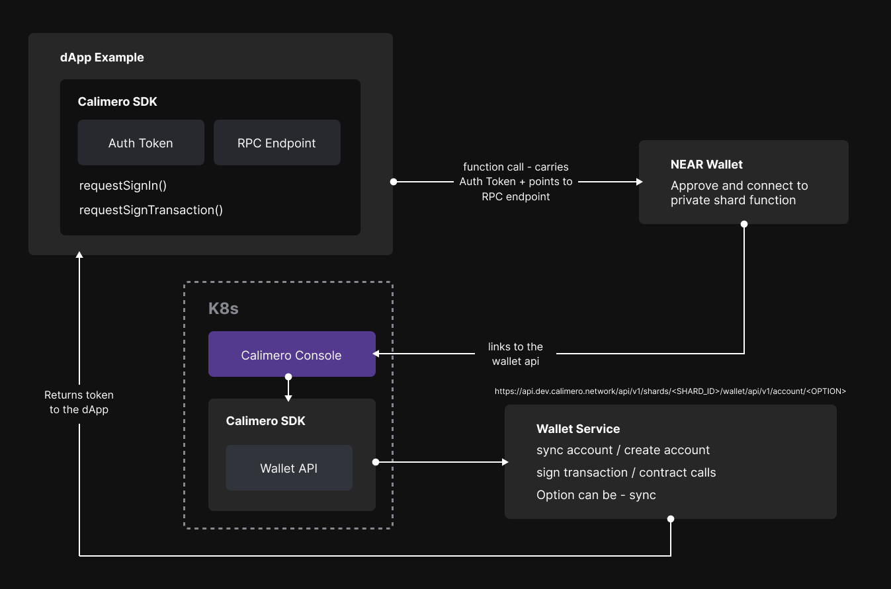

The Wallet SDK enables your DApp to connect to Calimero's private shard through the NEAR wallet. Follow the steps below to interact with the Calimero SDK and integrate it into your project.

## Interacting with the SDK

To interact with the Calimero SDK, the DApp is developed using Next.js and relies on the Calimero SDK, which is a Node.js dependency available on npmjs. 

## Initialize the SDK

- To initialize the Calimero SDK, the authentication token obtained from the Calimero console is inputted, along with the RPC endpoint

- The DApp then invokes functions like `requestSignIn` or `requestSignTransaction`, which redirect users to the NEAR wallet for approval 

- Upon approval of the requested action, such as sign-in, the connection to the Calimero shard is established

For first-time sign-ins:

- The sync API is called within the Calimero console wallet API service

- The wallet API service communicates with the wallet API web service, which in turn executes calls to the RPC endpoint, creating the account associated with the sign-in

- Upon successful synchronization and sign-in, a function key is returned, enabling the DApp to access contract calls and other available functions through the walletConnection object from the `near-api-js` package




## Example Usage
Once you have installed the Calimero SDK, you can use the provided methods to interact with the SDK. The `Calimero.isSignedIn()` method is used to check if auser has authorized with Calimero. In the example, we render a Login button for the user to click on.

```js
import React from 'react';

import { CalimeroAuth } from 'calimero-auth-sdk';

export default function Dashboard() {
  if (CalimeroAuth.isSignedIn()) {
    return <button onClick={CalimeroAuth.signOut}>
      Logout
    </button>
  }

  return(
  <button>
    <a href='/login'>Login with NEAR</a>
  </button>
);
}
```

The second part of the integration includes implementing a Login component which checks if the user has not signed in. Redirects the user to the NEAR wallet to authorize the connection with the Private Shard, once authorized it will redirect the user to this component and send the authorization request to the Calimero Authentication Service.

```js
import { CalimeroAuth } from 'calimero-auth-sdk';

export default function Login() {
    if (!CalimeroAuth.isSignedIn()) {
        CalimeroAuth.signIn({
            shardId: "testing.calimero",
            walletUrl: "https://testnet.mynearwallet.com/verify-owner",
            authServiceUrl: "http://localhost:1336"
        });
    }

    return (
        <div className="App">
            <header className="App-header">
            </header>
        </div>
    );
}
```

