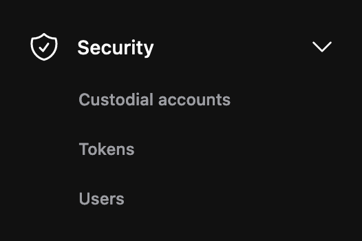

 
In custodial accounts, we only display those accounts for which the Calimero platform is the custodian. With your custodian account, you can create a key pair, add public keys and top up your tokens.

To access your custodial account, do the following:

1. Navigate to the Calimero [Console](https://app.calimero.network/dashboard).
2. Click on the Security dropdown in the left navigation menu.
3. Select **Custodial**.

By default Calimero creates an custodial account for you but you can go ahead and create your own by clicking on **Add an account**.

:::info
Your custodian account ID is your shard_name + the suffix calimero.testnet (SHARDNAME.calimero.testnet)
:::

## Top up account

Topping up the token balance allows users to add funds to their account and participate in transactions on the network.  To top up your account with tokens, you will need to follow these steps:

1. Click on  **⋮** and select **Top up Account**

2. Add the number of tokens that you want and click on **Top up** button

## Add public key

To add a public key to your account, you will need to follow these steps:

1. Click on  **⋮** and select **Add Public key**

2. Add your public key and click on **Add public key** button

:::info
You can only carry out these actions from the Calimero side
:::

## Need help?
Send a request to [support@calimero.network](mailto:support@calimero.network) or [https://www.calimero.network/trial](https://www.calimero.network/trial).

