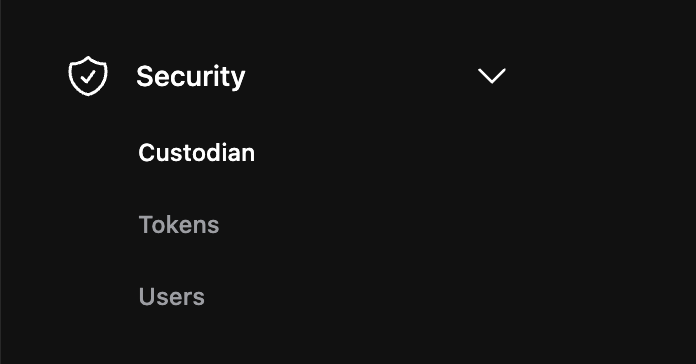

 
Accounts in the custodian are the ones which have at least one keypair in the calimero managed valut (KMS). In other words, we only display accounts for which  Calimero (the shard admin) are key custodians. With your custodian account, you can create a key pair, add public keys and top up your tokens.

If your shard name is 'demos-calimero-testnet', your custodian account name is 'demos.calimero.testnet'.

To access your custodian account, do the following:

1. Navigate to the Calimero [Console](https://app.calimero.network/dashboard).
2. Click on the Security dropdown in the left navigation menu.
3. Select **Custodian**.

By default Calimero creates an custodian account for you but you can go ahead and create your own by clicking on **Add an account**.

## Top up account

Topping up the token balance allows users to add funds to their account and participate in transactions on the network.  To top up your account with tokens, you will need to follow these steps:

1. Click on  **⋮** and select **Top Account**

2. Add the number of tokens that you want and click on **Top up**

## Add public key

To add a public key to your account, you will need to follow these steps:

1. Click on  **⋮** and select **Public key**

2. Add your public key and click on **Add public key**

:::info
In your custodian account you have account from the Calimero side and NEAR side, you carry out these actions on the Calimero side
:::

## Need help?
Send a request to [support@calimero.network](mailto:support@calimero.network) or [https://www.calimero.network/trial](https://www.calimero.network/trial).

