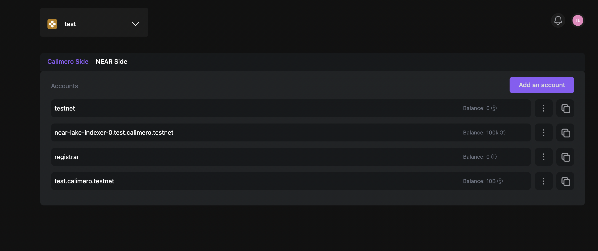
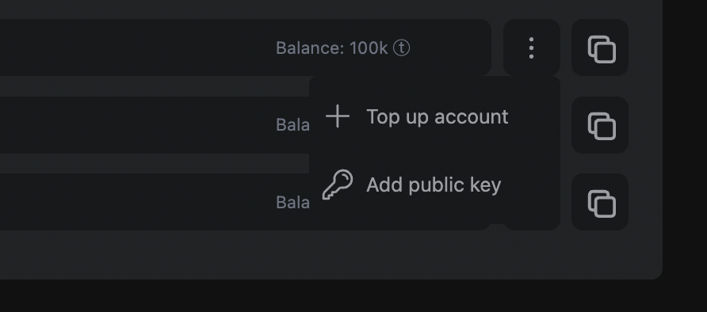
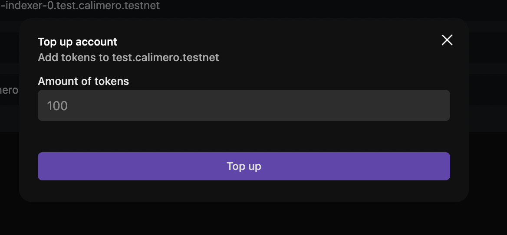
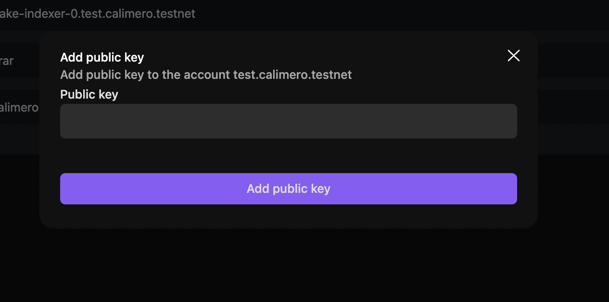

 
To add your public key you'll need your Private shard custodian account.  If your shard name is 'demos-calimero-testnet', your custodian account name is 'demos.calimero.testnet'.

To access your account ID, follow these steps:

1. Navigate to the Calimero [Console](https://app.calimero.network/dashboard).
2. Click on the Security dropdown in the left navigation menu.
3. Select **Custodian**.
By default Calimero creates an custodian account for you but you can go ahead and create your own by clicking on **Add an account**.

## Top up account
You can top up your account with tokens from your custodian account, to do so:

1. Click on  **⋮** and select **Top Account**

2. Add the number of tokens that you want and click on **Top up**

## Add public key

From your custodian acccount, you can add a public key to do so;

1. Click on  **⋮** and select **Public key**

2. Add your public key and click on **Add public key**

## Need help?
Send a request to [support@calimero.network](mailto:support@calimero.network) or [https://www.calimero.network/trial](https://www.calimero.network/trial).

