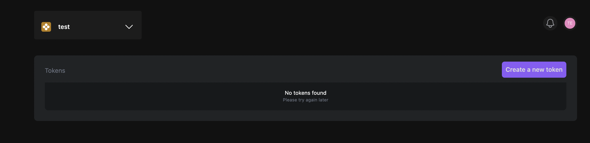

Adding users to your private shard can be a valuable way to enhance collaboration and streamline interactions on a blockchain network, while still maintaining a high level of security and control. You can allow multiple users to interact with your shard, to do so, follow these steps:

1. Navigate to [https://app.calimero.network/security/users](https://app.calimero.network/security/users).

::info
You can also access this from the console dashboard by clicking on **Security** > **Users** in the left navigation menu.
:::

2. Click on **Add user**.

3. Add the **User email** and select the type of **User permissions** you wish to give the user.

4. Click on **Invite**

## Edit current user permissions

Editing current user permissions in your private shard can be useful when a user's role or level of access within your shard needs to be adjusted. To do this;

1. Click on the user email.

2. You'll be redirected to a page where you can select or deselect the permissions you want to give that particular user.

