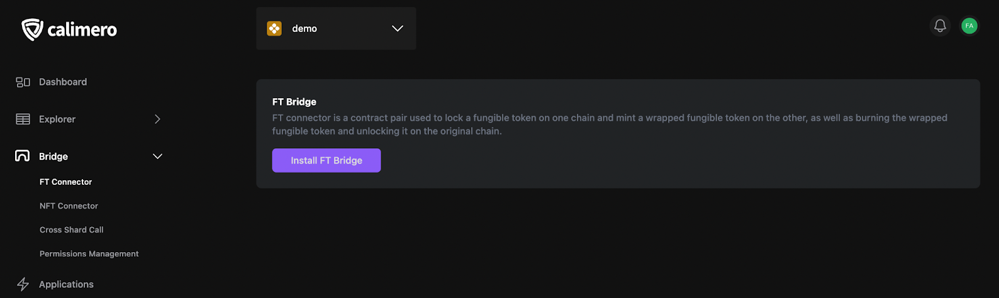
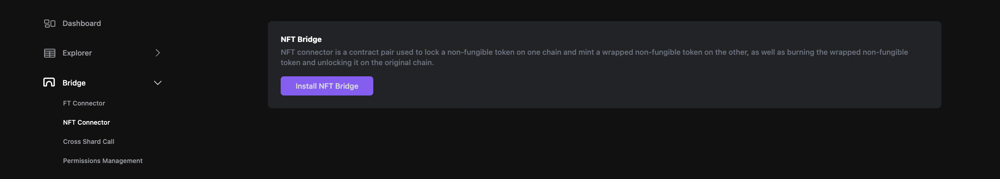
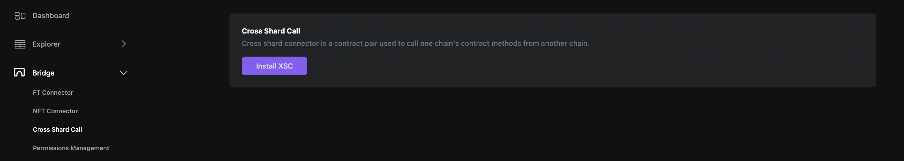
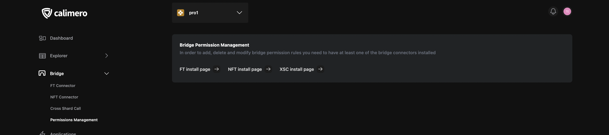
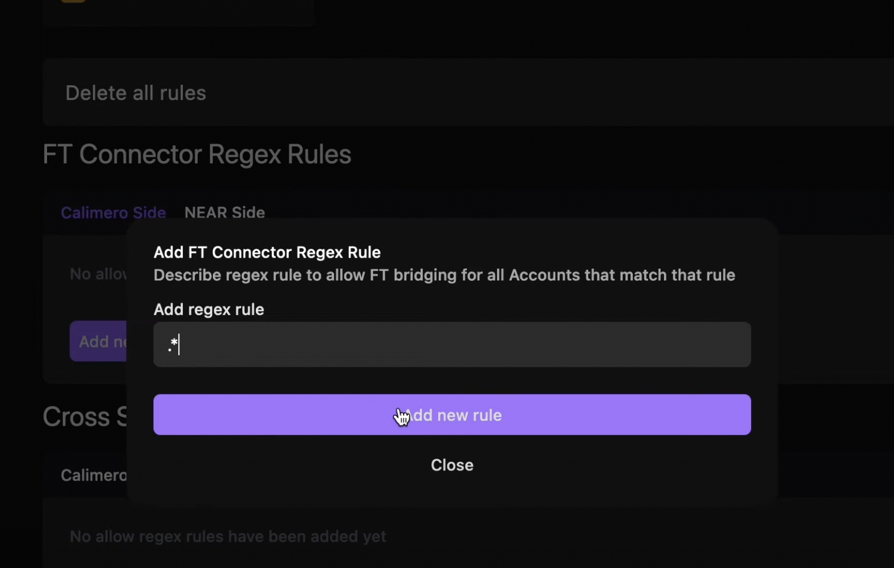

The NEAR to Calimero bridge provides users with the ability to move assets between NEAR public networks (Testnet or Mainnet) and their Private Shard. Additionally, the bridge enables cross-shard contract calls, including private smart contract calls within the Shard from a public contract, or public smart contract calls from a contract inside the Private Shard.

## Install the bridge

To bridge tokens, you need to install **Connectors**. Calimero supports the transfer of both fungible tokens (FTs) and non-fungible tokens (NFTs) between chains, and cross-shard calls through the Calimero bridge.

First, from your selected Shard in the [Console](https://app.calimero.network/dashboard), navigate to the **Bridge** in the left navigation bar.

### FT connector

The FT Connector is a contract pair used to lock a fungible token on one chain, mint a wrapped fungible token on the other, as well as burn the wrapped fungible token and unlock it on the original chain. Follow these steps to install the FT connector:

- Select **FT Connector**
- Click on **Install FT bridge**

### NFT connector

The NFT Connector is a contract pair used to lock a non-fungible token on one chain, mint a wrapped non-fungible token on the other, as well as burn the wrapped non-fungible token and unlock it on the original chain. Follow these steps to install the NFT connector:

- Select **NFT Connector**
- Click on **Install NFT bridge**

### Cross shard call

The Cross-Shard Connector is a contract pair used to call one chain's contract methods from another chain. Follow these steps to install the Cross-Shard Call connector:

- Select **Cross Shard Call**
- Click on **Install XSC**

:::info
For more details on Bridges and their architecture, refer to the [Bridge Architecture ](https://docs.calimero.network/bridge/architecture) documentation.
:::

## Permissions Management

In order to use the Calimero bridge to transfer FTs, NFTs, or make cross-Shard calls, you'll need to set up bridge permissions.

Connectors have a "deny all" default setting, and permissions must be explicitly granted for accounts. Permissions are managed on a connector basis for both NEAR (bridging from NEAR to Calimero) and Calimero (bridging from Calimero to NEAR).

### Regex rules

To allow bridging, you need to add a regex rule. When adding an allow rule for a connector, keep in mind that any Account ID that matches at least one allow rule can bridge assets. Here's an example of setting up rules:

- Add an allow rule for the XSC connector using the regex .* (allowing anyone to bridge).
- Add a deny rule pair using the regex .*evil.* for the account and .* for the contract ID.

With these rules set, any Account ID that does not contain the term "evil" can make cross-shard calls, while accounts containing "evil" cannot make any cross-shard calls.

:::info
For more details on permissions, refer to the [Permissions](/docs/bridge/bridging/2_permissions.mdx) documentation.
:::
