The Calimero bridge serves as a vital tool for users to transfer assets, including fungible tokens (FTs) and non-fungible tokens (NFTs), between the NEAR public network (Testnet or Mainnet) and Calimero private shard. Additionally, it facilitates cross-shard contract calls, allowing users to invoke smart contracts from a public contract into the shard.

The Calimero bridge comprises three essential bridge connectors:

- FT connector
- NFT connector
- Cross-shard call connector

## FT connector

The FT connector serves as a contract pair that simplifies the transfer of fungible tokens (FTs) between public chain and Calimero shard. It provides a straightforward process for locking an FT token on one chain, minting a wrapped version of the token on another chain, and later burning the wrapped token to unlock the original token. To install the FT connector:

- Select **FT Connector**
- Click on the **Install FT Bridge** button

Once the installation is successful, you will gain access to the FT page, which presents information about your FT contracts and displays transactions related to fungible tokens.

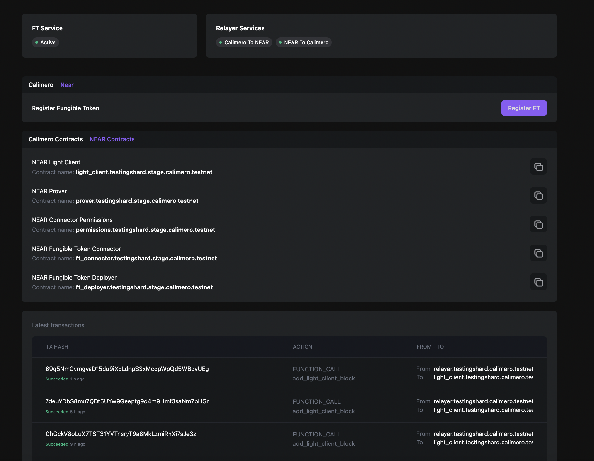

### Register FT token

Before bridging an FT token and transferring it between chains, you need to register the token. The registration process enables you to mint a wrapped FT token on the destination chain and subsequently burn it to unlock the original FT token on the source chain. To register an FT token:

- On the FT Connector page, click on the **Register FT** button

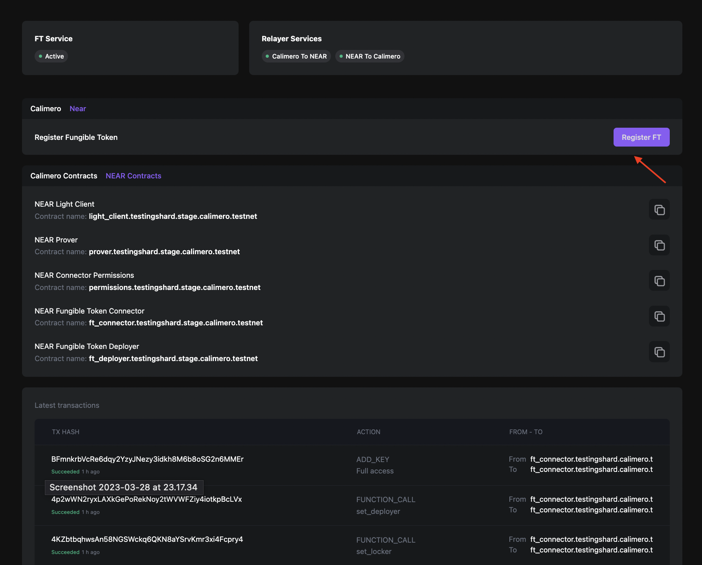

- A popup window will appear, requesting the contract address of your FT token
- Enter the contract address of your FT token in the provided field

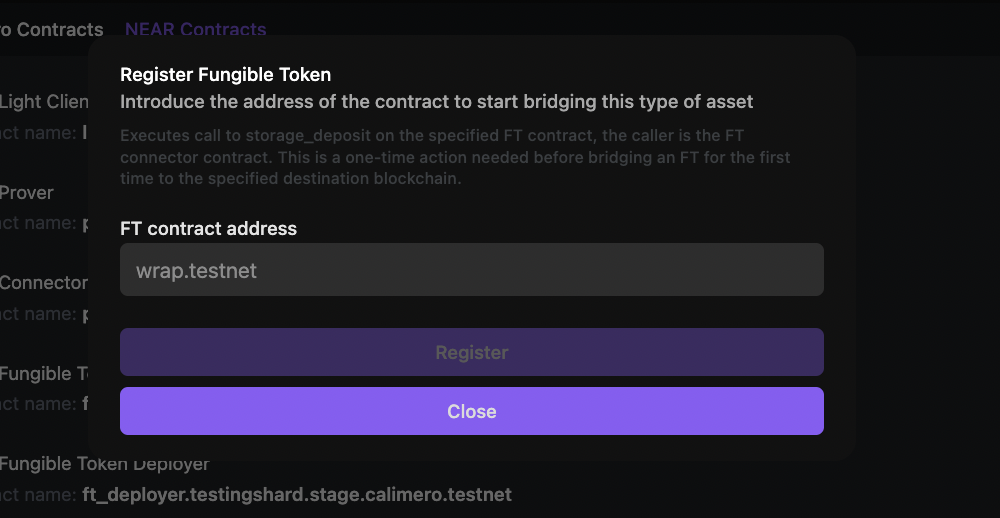

:::info
The registration step is a one-time action. However, there are some FT tokens such as USDN that do not require this step.
:::

## NFT connector

The NFT connector serves as a contract pair that facilitates the transfer of non-fungible tokens (NFTs) between public chain and Calimero shard. It simplifies the process of locking an NFT on one chain, minting a wrapped version of the token on another chain, and subsequently burning the wrapped token to unlock the original NFT. To install the NFT connector:

- Select **NFT Connector**
- Click on the **Install NFT Bridge** button

Once the installation is successful, you will gain access to the NFT page, which presents information about your NFT contracts and displays transactions related to non-fungible tokens.

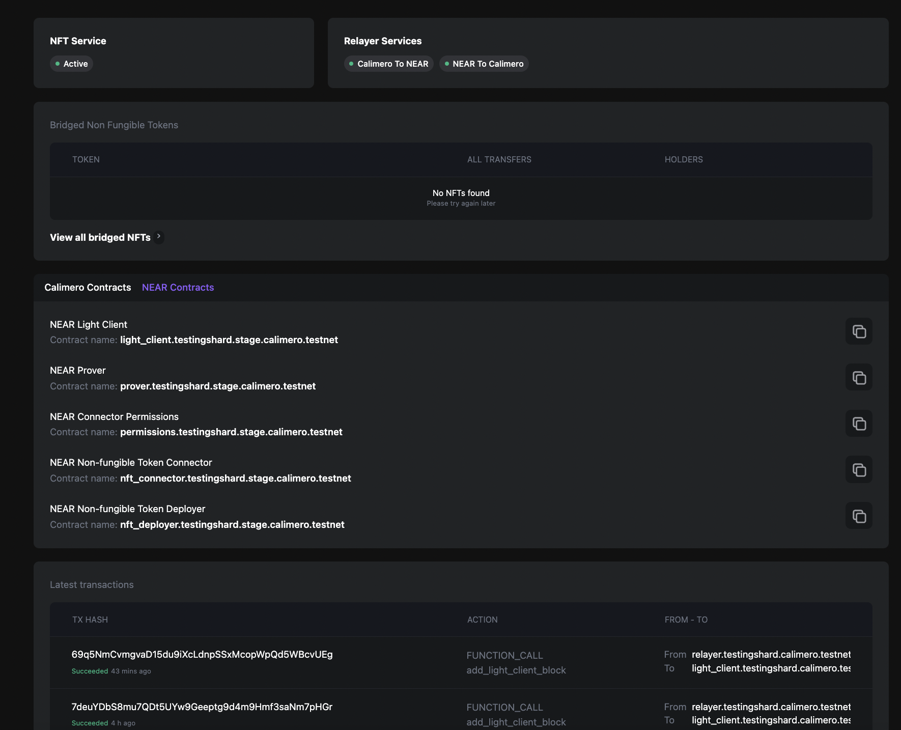

## Cross-shard call

The cross-shard connector is a contract pair used to call one chain's contract methods from another chain. Follow these steps to install the cross-shard call connector:

- Select **Cross Shard Call**
- Click on the **Install XSC** button

Once you have successfully installed the cross-shard connector, you will have access to the XSC page. On this page, you can view your XSC contracts and transactions related to cross-shard tokens.

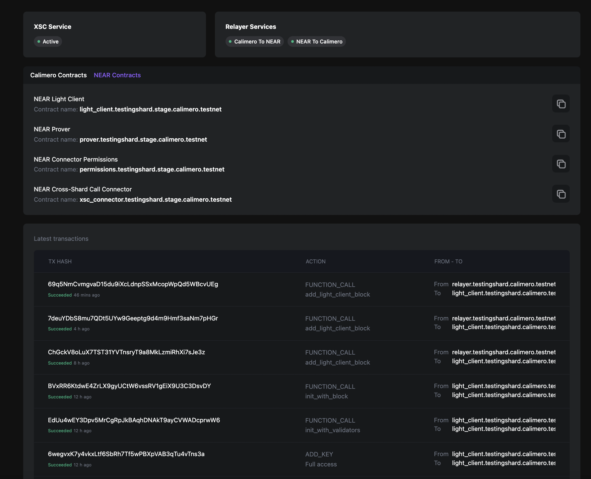

:::info
For more details on Bridges and their architecture, refer to the [Bridge Architecture ](https://docs.calimero.network/bridge/architecture) documentation.
:::

## Permissions Management

To ensure secure access and usage of the Calimero bridge for token transfers and cross-shard calls, it is important to manage permissions effectively. Permissions are used to control which accounts can utilize the bridge's features and perform specific actions.

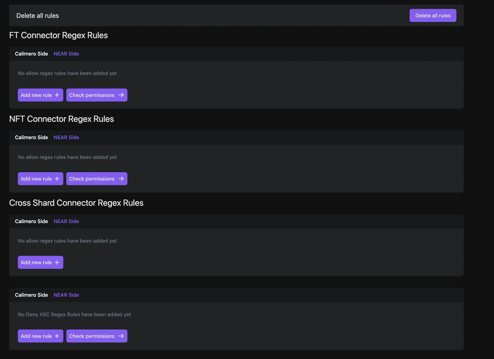

## FT and NFT connector regex rules

The FT and NFT connectors allow you to define regex rules that determine which accounts are allowed to bridge tokens. This rule known as the allow regex rule, grant permission to specific accounts, enabling them to utilize the bridge for token transfers.

To add an allow regex rule:

- Click on the **Add new rule** button

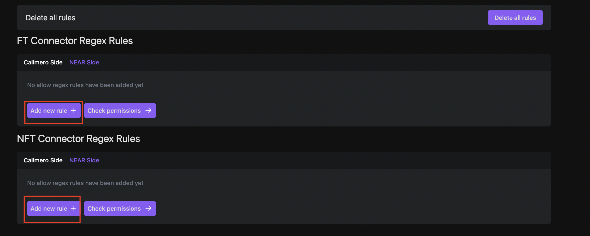

- In the input field, enter a regex pattern that matches the desired accounts for bridging

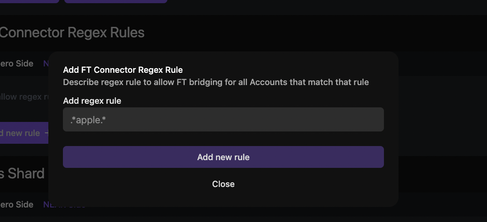

For example, if you want to allow testnet accounts, you can use the regex pattern `.*\.testnet`.  This regex rule allows any account ending with ".testnet" to bridge tokens using the FT or NFT connector.

### Verify FT and NFT connector permissions

To verify whether an account has the necessary permissions to use the FT or NFT connector:

- Click on the **Check Permissions** button 

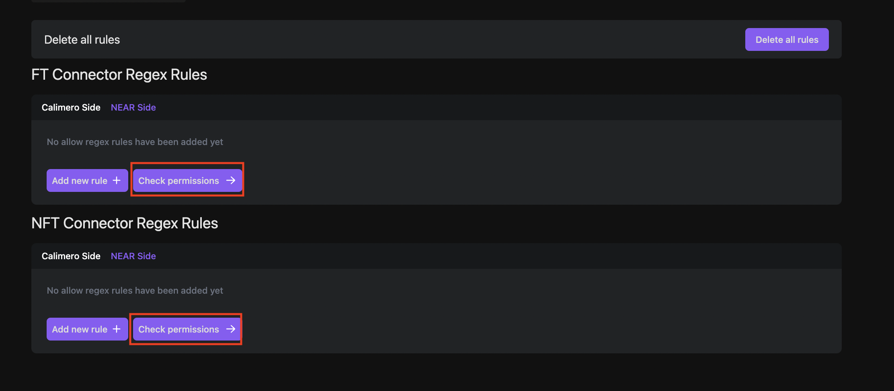

- Provide the Account ID for which you want to verify the permissions

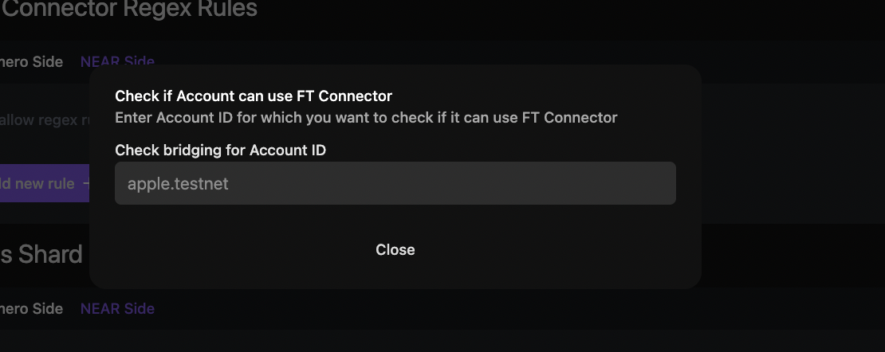

## Cross-shard connector regex rules

Cross-shard connectors have two rules: the account allow rule (similar to FT and NFT connectors) and the deny account rule.

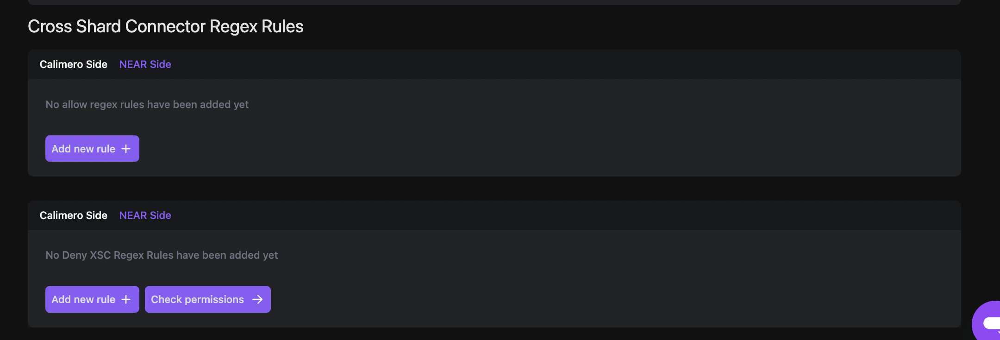

### Cross-shard allow regex rule

The account allow regex rule grants permission to specific accounts, enabling them to utilize the bridge for token transfers.

To add an account allow regex rule:

- Click on the **Add new rule** button
- In the input field, enter a regex pattern that matches the desired accounts for bridging. 

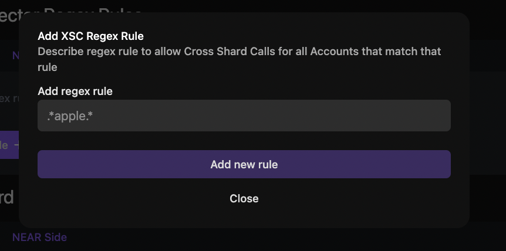

For example, if you want to allow testnet accounts, you can use the regex pattern `.*\.testnet`.

This regex rule allows any account ending with ".testnet" to bridge tokens using the cross-shard connector.

### Cross-shard deny regex rule

The deny account rule explicitly denies access or permission to a specific account or set of accounts to a specific contract or set of contracts.

To add a deny account rule regex rule:

- Click on the **Add new rule** button 

- Enter a regex pattern in the input fields to specify which account and contract pairs should be denied permission for cross-shard calls.

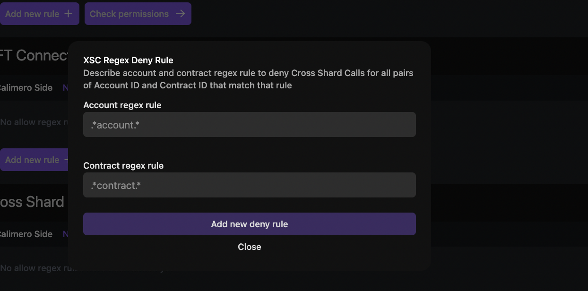

For example, using the regex pattern `.*evil.*` for the Account ID and `.*` for the Contract ID will block any accounts containing the term "evil" from making cross-shard calls.

### Verify cross-shard connector permission

To verify if a specific pair of Account ID and Contract ID is eligible for making cross-shard calls:

- Click on the **Check Permissions** button
- In the input fields, enter the relevant Account ID and Contract ID that you want to check for permissions

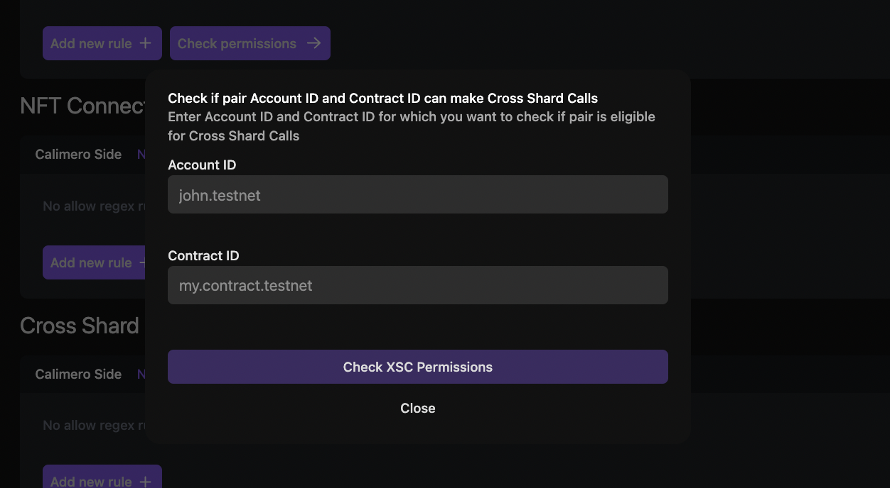

This process will determine if the specified pair has the necessary permissions to perform cross-shard calls.

:::info
For more detailed information regarding permissions, refer to the [Permissions](/docs/bridge/bridging/2_permissions.mdx) documentation.
:::
