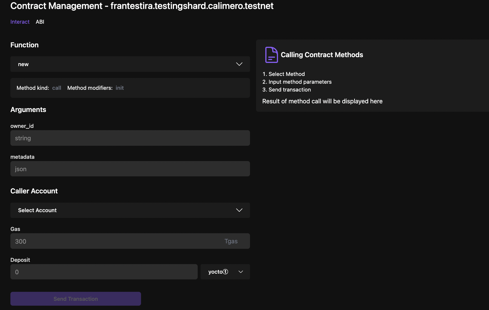

Contract management is a crucial feature that allows users to effectively interact with installed and deployed contracts. This feature enables users to upload their own `.wasm` and `ABI` files to the Console and deploy them to the blockchain.

When you navigate to the Contract Management Page, you will be presented with two tabs: **Installed Contracts** and **Deployed Contracts**.

## Installed Contract

On the Installed Contracts page, you can view a list of contracts that have been installed on your specific shard. Installing a contract involves uploading and saving the contract files to database and making them available for deployment from the Calimero Console. 
To install your contract, follow these steps:

Installed contract page shows the list of installed contracts for your specific shard. Installing the contract means putting the contract in the Installed state, meaning uploading the contract files to GCS and making the contract available for deployment from the Calimero Console. To install your contract:

- Clicking on the **Install contract** button, which will prompt you to upload your contract files.
- Provide a unique contract name, which will be displayed in the list of deployable contracts and used for storage purposes.
- Upload your binary file (.wasm)
- (Optional, but recommended) Upload the ABI file. If you upload an ABI file, a preview block will display the contents of the ABI file.
- Click on the **Install new contract**.

## Deployed Contract

On the Deployed Contracts tab, you can see a list of contracts that have been deployed on selected shard. Once a contract is installed, it can be deployed to blockchain from the deploy contract page. 
To deploy your contract on the blockchain, follow these steps:

- Select the installed contract that you want to deploy.
- Add your contract ID.
- Click on **Create account and deploy contract** button

This action also creates a subaccount, which can be viewed under [custodial accounts](/docs/getting_started/custodial.md), and deployes the smart contract wasm to it.

## Interacting with the contract

After a contract is deployed, it will be listed on the Deploy Contracts page. To interact with the contract, follow these steps:

- Select the contract with which you want to interact. This will open a page displaying a drop-down selector.

- Choose the desired call method from the drop-down list.
- Provide the method parameters/arguments.
- Select the contract name (subaccount name)
- (Optional) Specify the Gas fee and deposit. The default and minimum value for the deposit is 1 Ⓣ token.
- Click on **Send transaction**

The result of your method call will be displayed on the right-hand side. You can also view the transaction details in the [Explorer](https://app.calimero.network/explorer/dashboard).

