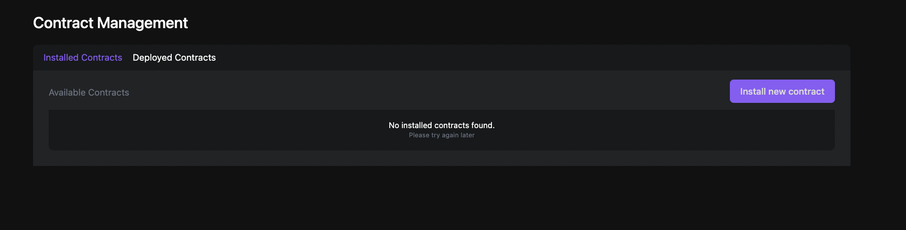
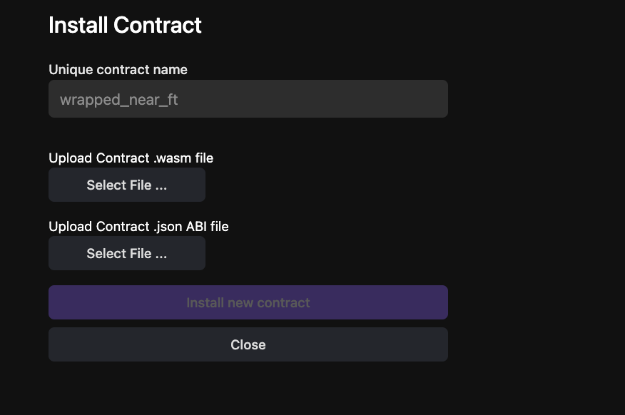

Contract management is a key feature that enables users to interact with contracts installed and deployed.

## Installed Contract

Installed contract is a contract that has folder with unique contract name located in the GCloud Bucket. Contract folder contains the binary file (.wasm) and the related ABI file (.json).

## Deployed Contract

A deployed (smart) contract refers to a contract account that has been created in a specific shard and has its binary file (.wasm) deployed on the blockchain.

Once deployed, these contracts can be managed and accessed through the Contract Management Page.
