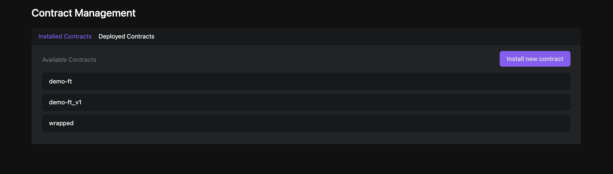
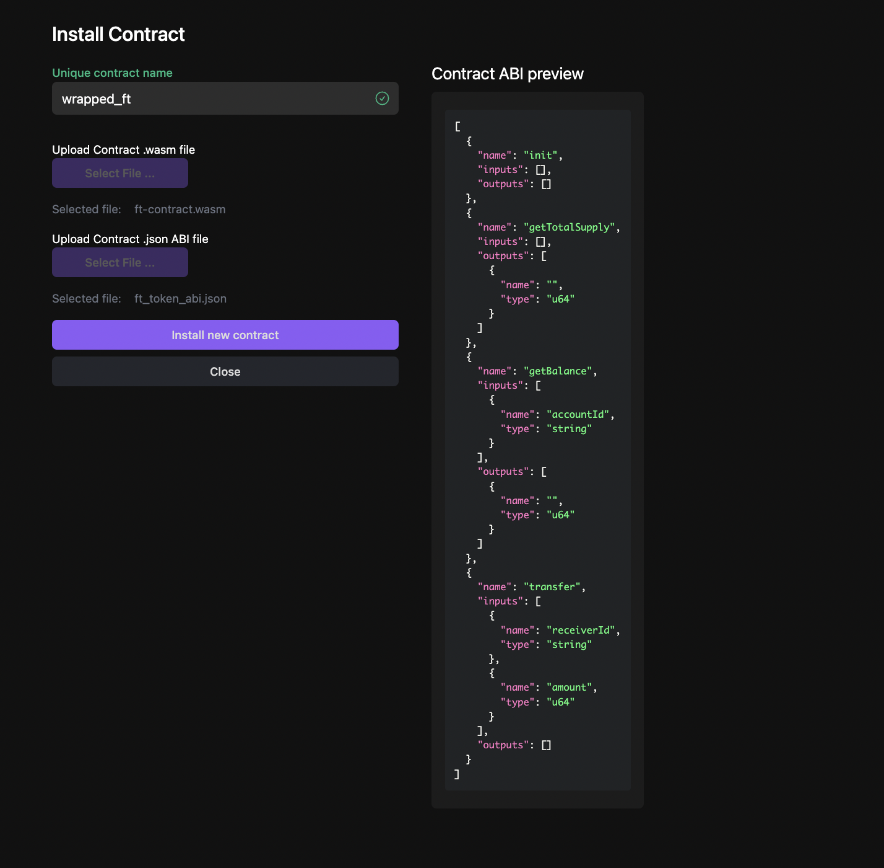
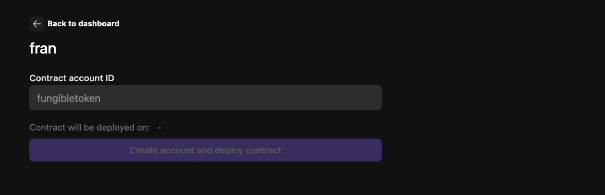
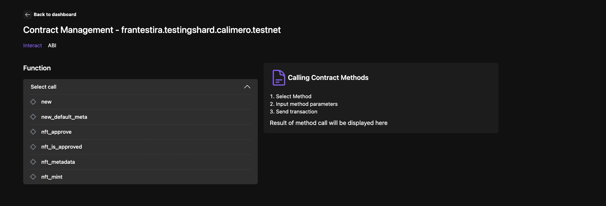
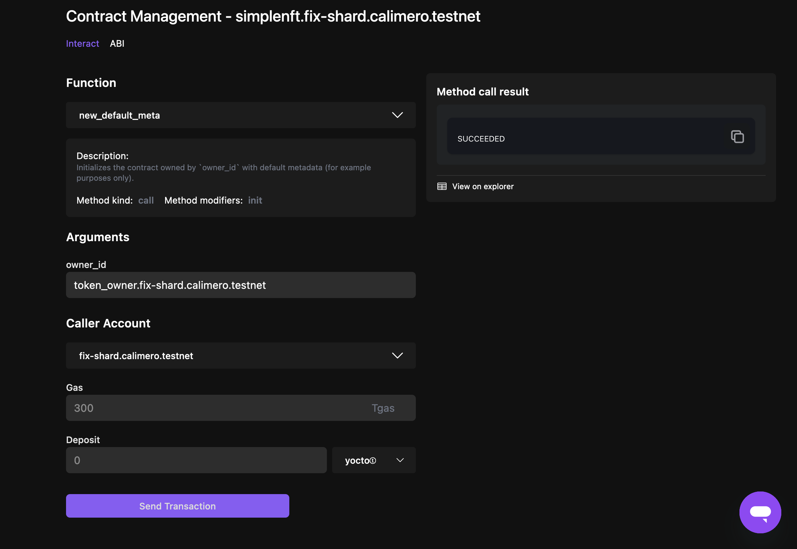
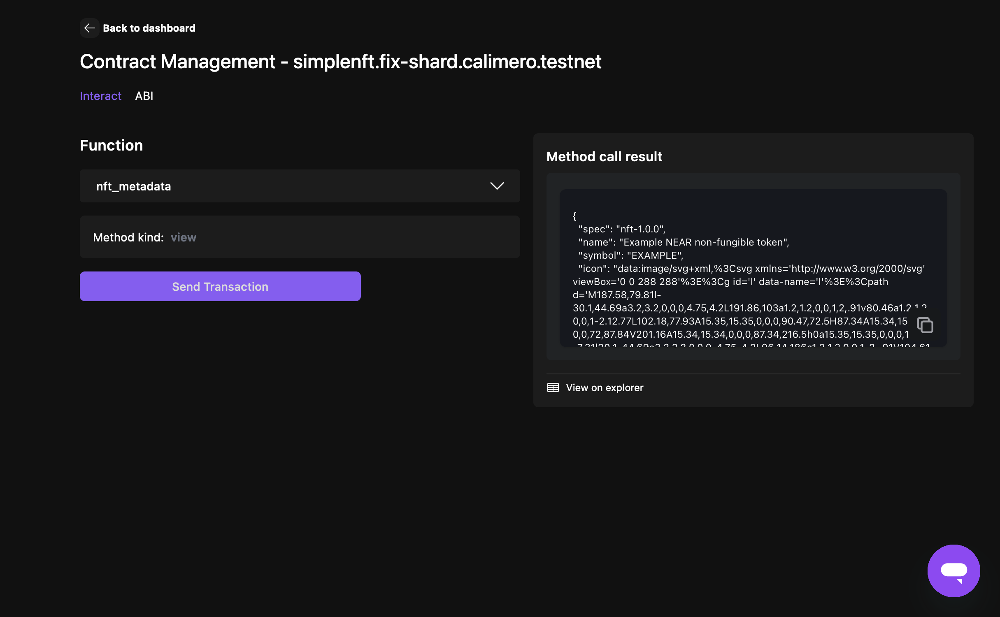

Contract management is a crucial feature that allows users to effectively interact with installed and deployed contracts. This feature enables users to upload their own `.wasm` and `ABI` files to the Console and deploy them to the blockchain.

When you navigate to the Contract Management Page, you will be presented with two tabs: **Installed Contracts** and **Deployed Contracts**.

## Installed Contracts

Installed contract page shows the list of installed contracts for your specific shard. Installing the contract means uploading and saving contract files to the database and making them available for deployment from the Calimero console. To install your contract:

- Clicking on the **Install contract** button, which will prompt you to upload your contract files
- Provide a unique contract name (the contract name will be displayed in the list of deployable contracts)
- Upload your binary file (`.wasm`)
- Upload the `.json` ABI file (you will see a block displaying the content of the file)
- Click on the **Install new contract** button

## Deployed Contracts

Deployed contracts page shows the list of deployed contracts for your specific shard. Installed contracts can be deployed to the blockchain. To deploy your contract:

- Select the installed contract that you want to deploy
- Add your contract ID
- Click on the **Create account and deploy contract** button

This action also creates a subaccount, which can be viewed under [custodial accounts](/docs/getting_started/custodial.md), and deployes the smart contract wasm to it.

## Interacting with the contract

After a contract is deployed, it will be listed on the Deployed Contracts page. To interact with the contract:

- Select the contract you want to interact with. This will open a page displaying a drop-down selector.

- Choose the desired call method from the drop-down
- Provide the method parameters/arguments
- From the dropdown list select your contract name (subaccount name)
- (Optional) Specify the Gas fee and deposit. The default and minimum value for the deposit is 1 Ⓣ token
- Click on **Send transaction** button

he result of your method call will be displayed and you can see transaction details in the [Explorer](https://app.calimero.network/explorer/dashboard).

