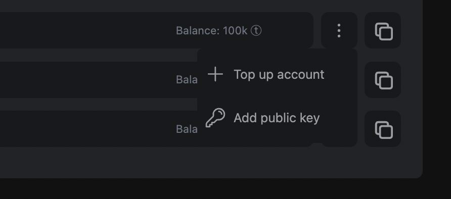

Shard management is a key feature that allows users to manage various aspects related to their selected shard within the console. With Shard management, users can configure nodes, add accounts, and perform token transfers.

## Custodial account

In custodial accounts, on the Calimero side, we only display accounts for which the Calimero platform has stored keys. With your custodial account, you can create a key pair, add public keys and top up your tokens.

By default Calimero creates an custodial account for you but you create your own by clicking on **Add an account**.

### Subaccount

To create a **Subaccount** you'll need to provide an **Account ID**. You also have the option to provide a public key

If you don't provide a public key, a keypair will be randomly created, and credentials will be sent to your email address.

:::info
Account ID part consists of lowercase alphanumeric symbols separated by either _ or - . Maximum total length is 64, including the shard master account suffix.
:::

### Top level account

To create a **Top Level Account** you'll need to provide only an **Account ID**. You can't add public key to top level accounts.

### Add public key

You can only add public key to subaccount. To do so, you will need to follow these steps:

- Click on  **⋮** and select **Add public key**

- Add your public key and click on **Add public key** button

:::info
You can only carry out these actions from the Calimero side
:::

## Token Transfer

You can transfer tokens from custodial accounts (on the Calimero side, accounts for which we have stored keys) to public blockchain accounts and other custodial accounts.

## Configure your Private Shard

:::info
Developer Shards are nonconfigurable. You can only configure nodes for proffesional shard
:::

Only Professional Shards are configurable. You can configure the Validator nodes, RPC nodes, Archive RPC nodes and Indexer nodes.

It is important to note that when configuring professional shard nodes, users will be charged based on the number of nodes configured.

