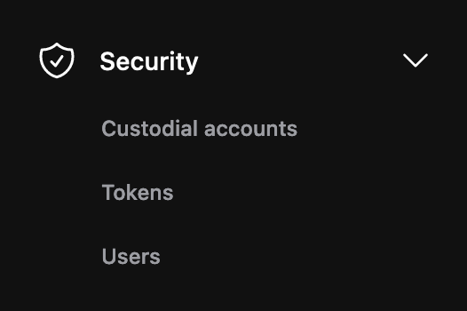
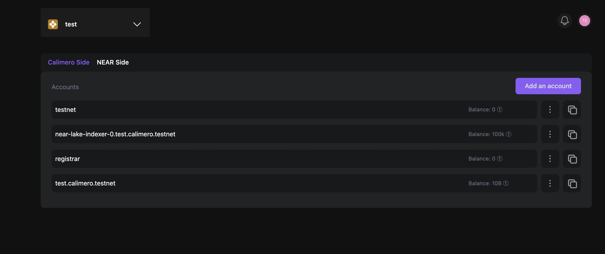
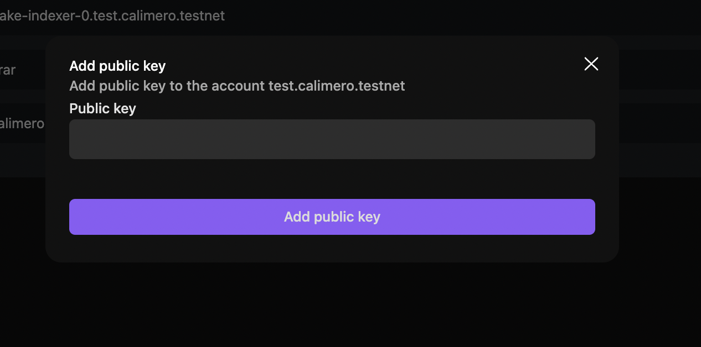

Shard management is a key feature that allows users to manage various aspects related to a selected shard within a blockchain network. With Shard management, users can configure nodes, add accounts, and perform token transfers from custodial accounts (on the Calimero side, accounts for which we have stored keys) to public blockchain and other custodial account.

## Custodial account

In custodial accounts, on the Calimero side, we only display accounts for which the Calimero platform has stored keys. With your custodial account, you can create a key pair, add public keys and top up your tokens.

To access your custodial account, from the **Shard Management**, select **Custodial accounts**.

By default Calimero creates an custodial account for you but you can go ahead and create your own by clicking on **Add an account**.

:::info
Your custodial account ID is your shard_name + the suffix calimero.testnet (SHARDNAME.calimero.testnet)
:::

### Top up account

Topping up the token balance allows users to add funds to their account and participate in transactions on the network.  To top up your account with tokens, you will need to follow these steps:

- Click on  **⋮** and select **Top up Account**

- Add the number of tokens that you want and click on **Top up** button

### Add public key

To add a public key to your account, you will need to follow these steps:

- Click on  **⋮** and select **Add Public key**

- Add your public key and click on **Add public key** button

:::info
You can only carry out these actions from the Calimero side
:::

## Token Transfer

You can transfer tokens from custodial accounts (on the Calimero side, accounts for which we have stored keys) to public blockchain accounts and other custodial accounts.

## Configure your Private Shard

:::info
Developer Shards are nonconfigurable. You can only configure nodes for proffesional shard
:::

Only Professional Shards are configurable