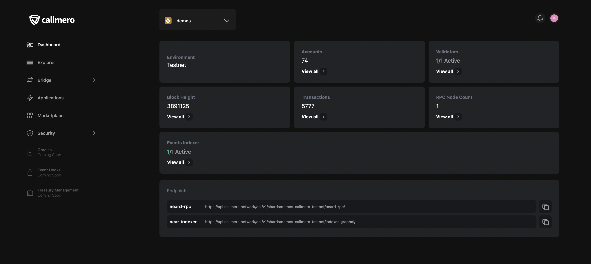

The [Console](https://app.calimero.network/dashboard) dashboard is your frontend to managing your Calimero Private Shard.  Here you can access all the information about your nodes and services. The dashboard also provides users with access to important information such as the RPC and Indexer GraphQL URL endpoints, as well as basic statistics about the network, including current block height, number of transactions, and number of accounts.

If your infrastructure needs to grow, you can use the Console to scale up the number of validators, RPCs, and indexers running on your network. This ensures that your network can handle increased traffic as your business grows.

:::info
This is not currently supported, but will be when the Professional plan is introduced
:::

## Components of the dashboard

- **Environment**: This refers to either Testnet or Mainnet blockchain environment.
- **Account**: This refers to the total number of account you have in each shard
- **Validators**: This refers to the number of active validator node currently participating in the consensus process of validating transactions and creating new blocks in the blockchain network.
- **Block height**:  This refers to the number of blocks that have been added to the blockchain within that specific private shard.
- **Transactions**: This refers to all transactions(_FUNCTION_CALL, CREATE_ACCOUNT, ADD_KEY, TRANSFER_ etc) you have made in the shard.
- **RPC Node count**: This refers to the number of active RPC node currently running and is able to respond to requests from clients to execute specific procedures or functions on the blockchain network.
- **Event Indexer**: This refers to the number of active indexers currently listening to the blockchain network and capturing relevant data about specific events generated by smart contracts or other transactions on the blockchain network.
- **Endpoint**: To interact with the private shard we provide two endpoints:
    - **neard-rpc**: This refers to the endpoint for interacting with the Calimero RPC Service.
    - **near-rpc**: This refers to the endpoint for interacting with the Calimero GraphQL Indexer Service.

