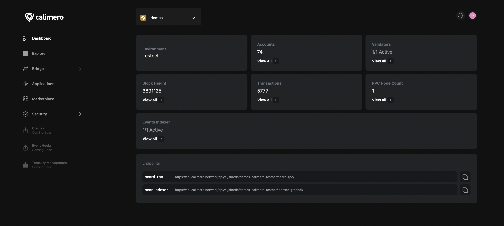

The Calimero console dashboard is the first page you'll see once logged in to the Calimero [Console](https://app.calimero.network/dashboard). The dashboard contains important information which will be listed below

- **Environment**: This refers to either Testnet or Mainnet blockchain environment.
- **Account**: This refers to the total number of account you have in each shard
- **Validators**: This refers to the number of active validator node currently participating in the consensus process of validating transactions and creating new blocks in the blockchain network.
- **Block height**:  This refers to the number of blocks that have been added to the blockchain within that specific private shard.
- **Transactions**: This refers to all transactions(_FUNCTION_CALL, CREATE_ACCOUNT, ADD_KEY, TRANSFER_ etc) you have made in the shard.
- **RPC Node count**: This refers to the number of active rpc node currently running and is able to respond to requests from clients to execute specific procedures or functions on the blockchain network.
- **Event Indexer**: This refers to the number of active indexers currently listening to the blockchain network and capturing relevant data about specific events as they occur. The
- **Endpoint**: To interact with the private shard we provide two endpoints:
    - **neard-rpc**: This refers to the endpoint for interacting with the Calimero RPC Service.
    - **near-rpc**: This refers to the endpoint for interacting with the Calimero GraphQL Indexer Service.

## Need help?

Send a request to [support@calimero.network](mailto:support@calimero.network) or [https://www.calimero.network/trial](https://www.calimero.network/trial).