From your  Calimero [Console](https://app.calimero.network/explorer/dashboard) you can access the explorer which provides you with the ability to view all crypto transactions and information including: accounts, blocks, transactions and receipts, Fungible Tokens and Non-Fungible Tokens in details. 

It is by default a fully private explorer only available to the administrators of the network, but specific information can be shared via API endpoints or shared links through the permissions management service implemented inside the Console.

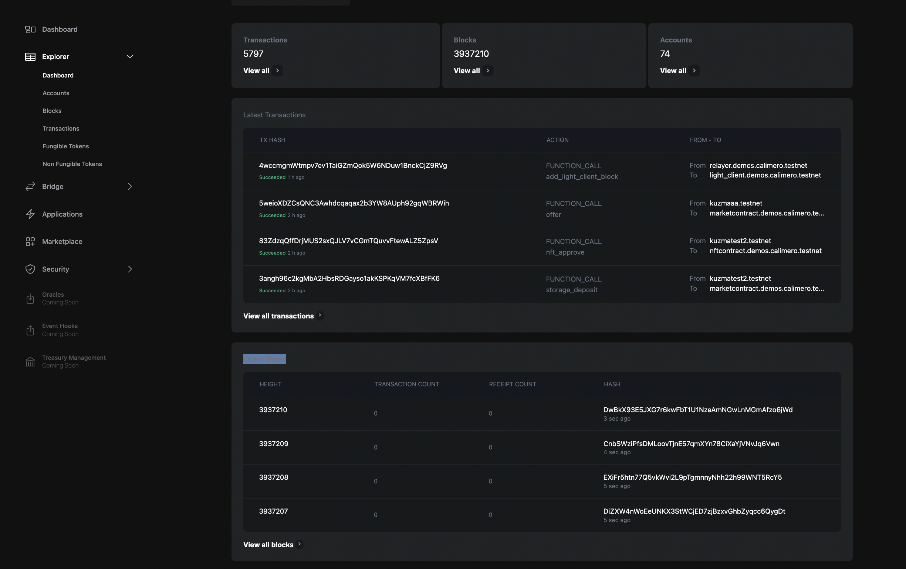

## Account

Accounts store digital assets, maintain balances, and track transactions.

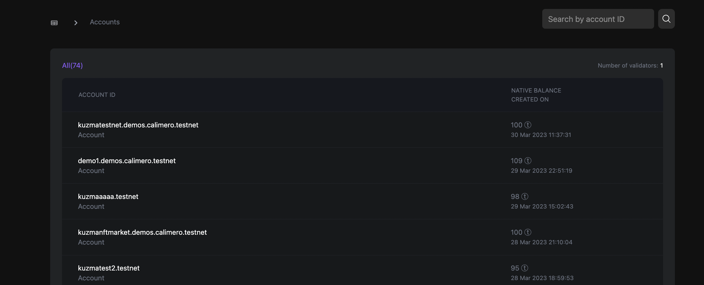

By clicking on any of the account ID, you'll be able to have an overview of:

- The number of transactions occured on that account
- The amount of storage used
- The native account balance currently on the account
- The amount of validator stake used
- The transaction hash details
- The total amount of fungible tokens the account has
-  The total amount of non fungible tokens the account has

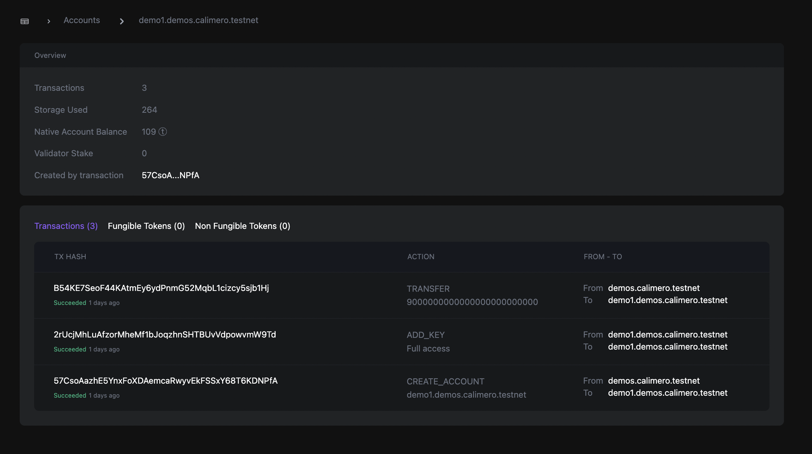

## Blocks

Blocks serve as a record of transactions and other network activity. Each block in the private shard contains a unique cryptographic hash of the previous block in the chain, which creates a secure and tamper-proof record of all network activity. As new transactions are submitted to the network, they are validated by the network's validators and added to a new block in the chain. Once the block is validated, it is added to the private shard and becomes part of the network's transaction history.

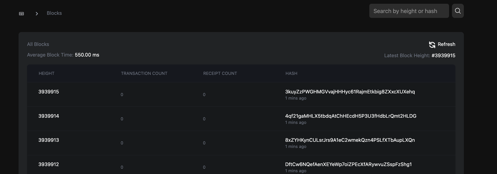

By clicking on any of the blocks, you'll be able to have an overview of:

- The date the transactions occured
- The account author of transaction
- The status of the transaction
- The block and parent hash
- The transaction amount
- The receipt of the transaction
- The gas used for the transaction

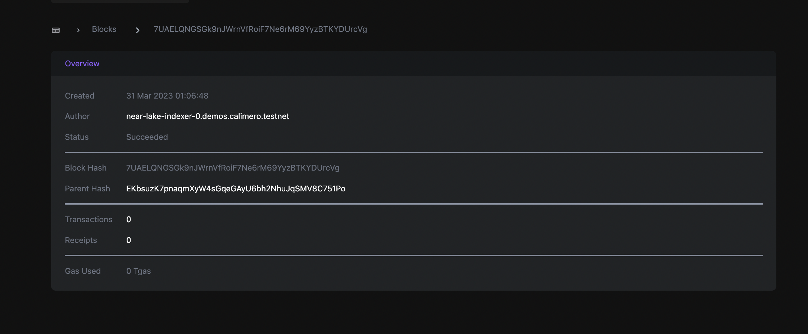

## Transactions

Transactions provides data and insights into transaction activities, your method call from one account to the other, transaction hash, transaction status, related to network activity.

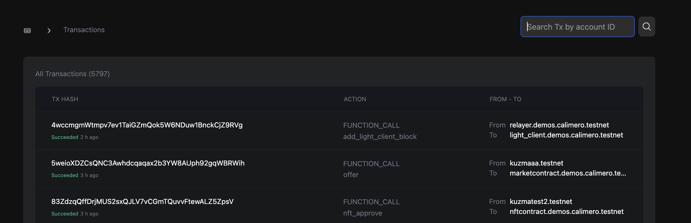

By clicking on any of the blocks, you'll be able to have an overview of:

- The Tx hash
- The status of the transaction
- The date the transaction was created
- The account it was sent from
- The account that received the transaction
- The block height
- The block hash
- The deposit value
- The transaction fee
- The amount of the attached gas used

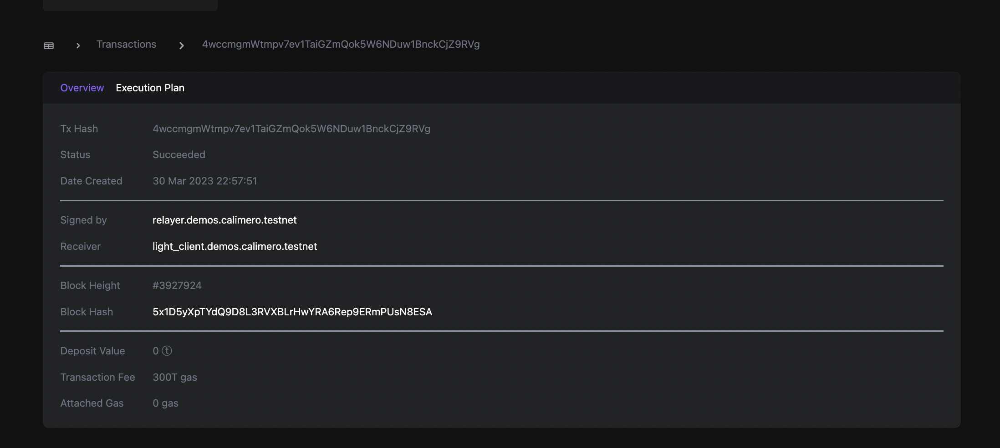

## Fungible tokens

FT tokens are digital assets that can be transferred between accounts on the network and can be used as a form of currency or to represent other digital or physical assets. The fungible token shows data on the total fungible token transfers in your shard. 

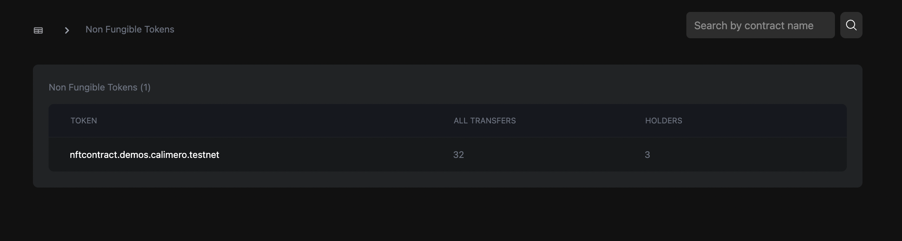

By clicking on any of the fungible tokens, you'll have both an overview of the transaction and contract information.

- The number of transactions occured on that account
- The amount of storage used
- The native account balance currently on the account
- The amount of validator stake used
- The transactio hash details
- The total amount of fungible tokens the account has
- The total amount of non fungible tokens the account has

For the contract information: 
- Created At
- Locked
- Last Update
- Transaction Hash
- Code Hash
- Holders
- Volume
- All Transfers

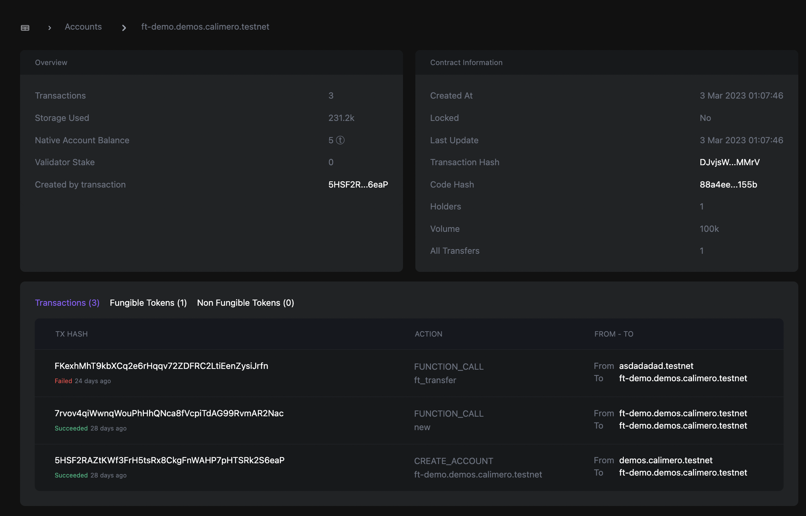

## Non-Fungible tokens

NFT tokens are digital assets are unique digital assets that are not interchangeable and represent ownership or proof of authenticity of a specific asset. The non-fungible token page shows data on the total nft transfers in your shard. 

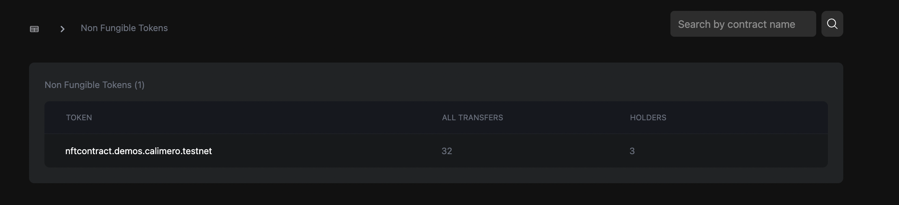

By clicking on any of the blocks, you'll have both an overview of the transaction and contract information.

- The number of transactions occured on that account
- The amount of storage used
- The native account balance currently on the account
- The amount of validator stake used
- The transactio hash details
- The total amount of fungible tokens the account has
- The total amount of non fungible tokens the account has

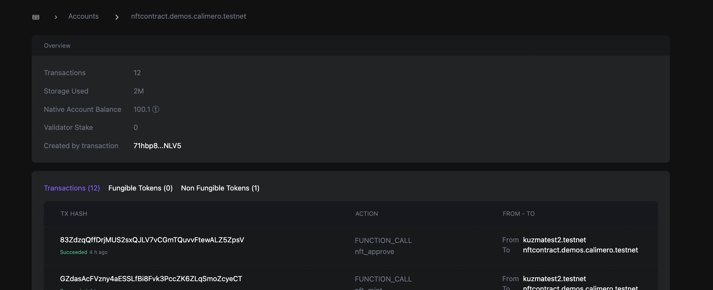
