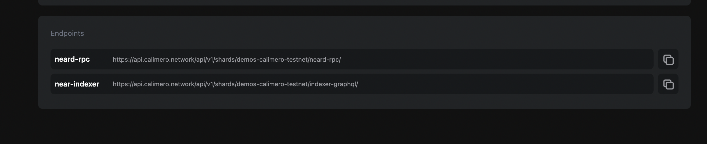
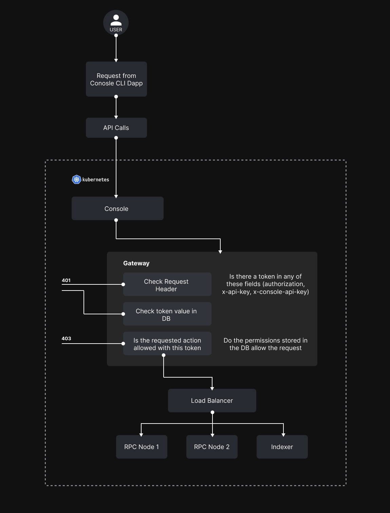

Calimero Gateway is the service responsible for allowing or rejecting requests towards private shard components. Calimero is private by nature, and the gateway is the component which allows authorized users and applications to interact with the private shard. To allow an access control more detailed than just allow/deny, permissions are implemented on the gateway level. 

## Incoming requests
All requests towards the private shard are routed through the gateway. The gateway also acts as an intermediary layer between the client and the private shard infrastructure including the RPC and GraphQL Indexer endpoints. Accessing the blockchain means sending requests to the RPC nodes or querying the indexer nodes.

The two endpoints to access are:
- The **RPC endpoint** for sending transactions and fetching data directly from the Shard
- The **Indexer GraphQL endpoint** for fetching Indexer Private Shard off-chain stored data inside a Postgres database with a GraphQL reverse proxy in front

The structure of a request towards the RPC node can be studied at [NEAR doc](https://near-nodes.io/rpc), but the essentials are:

- each request contains a _request_ object
- the request object contains the _method_ field and the _params_ object
- the params object contains the _request_type_ field

Additionally, to keep the private shard private, the requests must have an authorization token in the request header. Requests without the token in an authorization header are immediately rejected.

## Authorization
The requests are authorized by using an authorization token. Calimero Console uses a custom authorization header, the near-cli uses the x-api-key header, while applications can use either the standard authorization or the x-api-key header, along with the authorization token issued from the Calimero Console.

## Permissions
The permissions are implemented as an allow list, linked to the token. The database holds the token with the associated actions which are allowed:

## Write (execute transactions on the blockchain)
- view transaction status
- view account keys
- view the state of accounts
- view the contract state
- view block details
- view chunk details

Alongside the actions, the database holds the ID of the shard where these actions can be performed.

