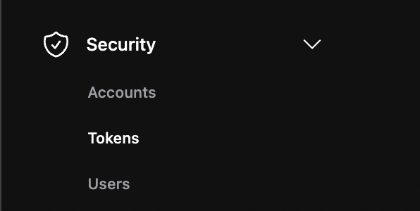
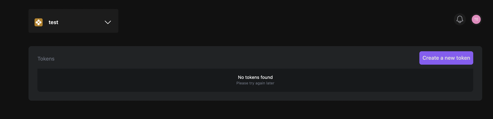
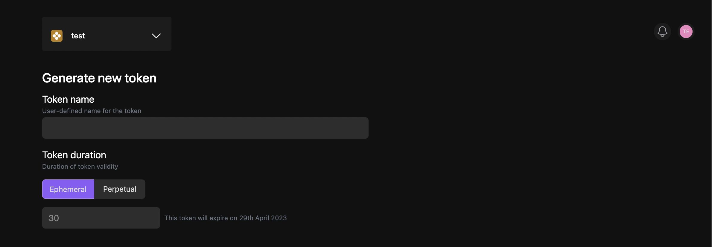
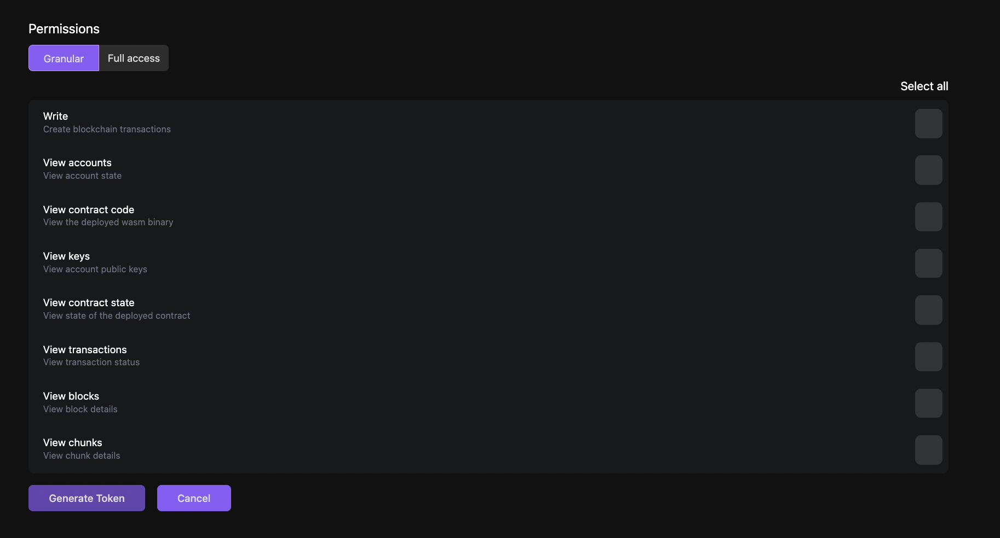
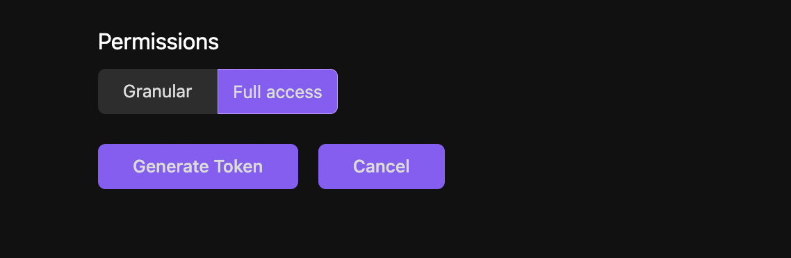

Before running any contract or deploying any application on your private shard, you must first generate a Calimero auth token. Authentication tokens strengthen account security by verifying users identity. These unique codes offer extra protection from unauthorized access. This token will authenticate and authorize external applications to communicate with your shard. Calimero is a permissioned chain and it allows for granular control over the token's time to live and associated permissions.

To create an auth token, follow these steps:

1. Navigate to the Calimero [Console](https://app.calimero.network/dashboard).
2. Click on the Security dropdown in the left navigation menu.
3. Select **Tokens**.


4. Click on **Create new token**.


5. Choose a name and select a duration for your auth token.


6. Configure the token's permissions by selecting the appropriate access. You can choose either **Granular** or full access


Granular access have the following checkboxes represent different types of permissions, such as:

- **Write**: Create blockchain
- **View accounts**: View account states
- **View contract code**: View the deployed wasm binary
- **View keys**: View account public keys
- **View contract state**: View state of the deployed contract
- **View transactions**: View transaction status
- **View blocks**: View block details
- **View chunks**: View chunk details

7. Click on **Generate Token**.


8. Once the token is issued, you can copy it to your clipboard or request to be sent to you via email.

:::tip
Once you have created your auth token, be sure to store it in a secure location, as it will be required to communicate with your private shard. The token cannot be obtained afterwards, which means you’ll have to issue a new token if you forget its value.
:::

With your auth token in hand, you are ready to call smart contracts or deploy dapps on Calimero Private Shard!

## Setting up the NEAR CLI to access the Shard via CLI

To deploy a contract on a Calimero shard using `near-cli`, you need to set the token value that gives permission to deploy contracts and make function calls using **near set-api-key** command. But, as of now, the "--nodeUrl" option is ignored, so you have to set the default node to <https://rpc.testnet.near.org>. To set up your near CLI run the following commands, in your terminal:

1. Set API key

```
 near set-api-key https://rpc.testnet.near.org <AUTH_TOKEN>   
```
- **<AUTH_TOKEN>**: is your copied token ID.

2. Create a new keypair for the shard main account (if your shard name is 'demos-calimero-testnet', your custodian main account is 'demos.calimero.testnet').

```
 near generate-key <MAIN_ACCOUNT_ID> --networkId <SHARD_ID>   
```

- **<MAIN_ACCOUNT_ID>**: is your custodian account ID.  For more information, see [Access account ID](/docs/getting_started/access_account.md)
- **<SHARD_ID>**: is your shard name. For more information, see [set up your shard](/docs/getting_started/running_a_shard.md)

3. The keypair created isand stored it in  `~/.near-credentials/` folder. Navigate to the `~/.near-credentials/` folder to access your keypair.

```
cd ~/.near-credentials
```

Then navigate to your stored keypair file which is usually in a `.json` format.

4. Open your `.json` file and copy the Public key.
5. Open Calimero [Console](https://app.calimero.network/dashboard)
6. Click on **Security**
7. Click on **Custodian**
8. Search for your custodian account ID in the list and click on the  `⋮` three dots menu.
9. Click on Add public key


## Need help?

Send a request to [support@calimero.network](mailto:support@calimero.network) or [https://www.calimero.network/trial](https://www.calimero.network/trial).
