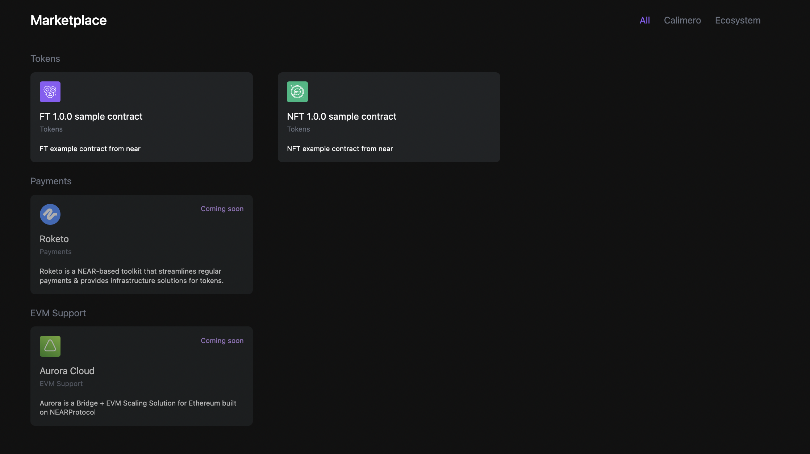
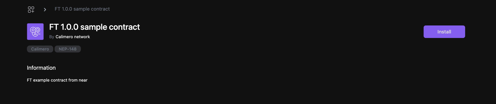
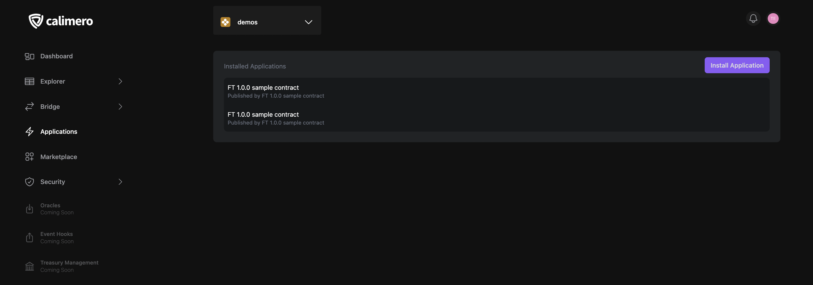

The marketplace allows users to browse and install pre-built smart contracts onto their private shard. By utilizing the marketplace to install contracts in your private shard, you can save time and effort by avoiding the need to write and deploy your own smart contracts. 

:::info
Payments and EVM support coming soon
:::

## Install tokens from your marketplace

To install smart contracts from your marketplace, do the following:

1. Navigate to the Calimero [Console](https://app.calimero.network/dashboard).

2. Click on the **Marketplace** in the left navigation menu.

4. Click on any of the contract you want to install

5. Click on **Install**

## Viewing  installed applications

All installed contracts are viewed from **Applications** which is located in the left navigation menu of the console.

## Need help?

Send a request to [support@calimero.network](mailto:support@calimero.network) or [https://www.calimero.network/trial](https://www.calimero.network/trial).
