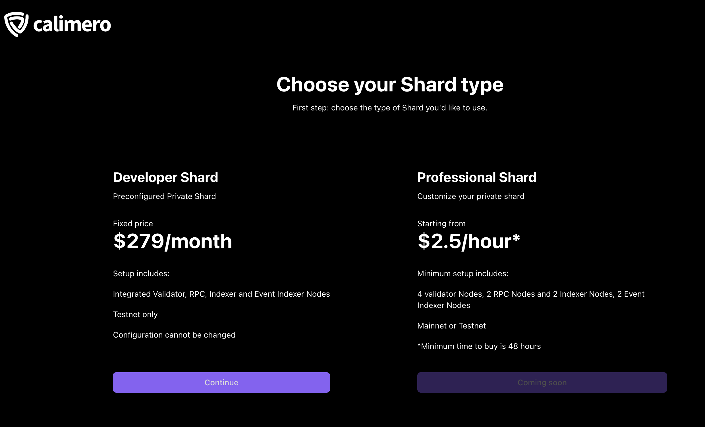

To set up your private shard:

1. Navigate to the Calimero [Console](https://app.calimero.network/dashboard).

2. Click on the Shard dropdown on the top navigation bar. 

3. You will be prompted to choose your shard type. Select the shard type for your needs. For more information, see our [pricing plans](https://www.calimero.network/plans)

:::note
Currently we only have support for Devlopers Shard, Professional Shard will be coming soon to the Calimero Network.
:::

4. Add a name and description for your shard.

5. Click on **Create Shard** to start the deployment process.

Once the deployment process is complete, you will have access to your private shard on the Calimero Network.

## Need help?

Send an email to [support@calimero.network](mailto:support@calimero.network) or via https://www.calimero.network/contact.
