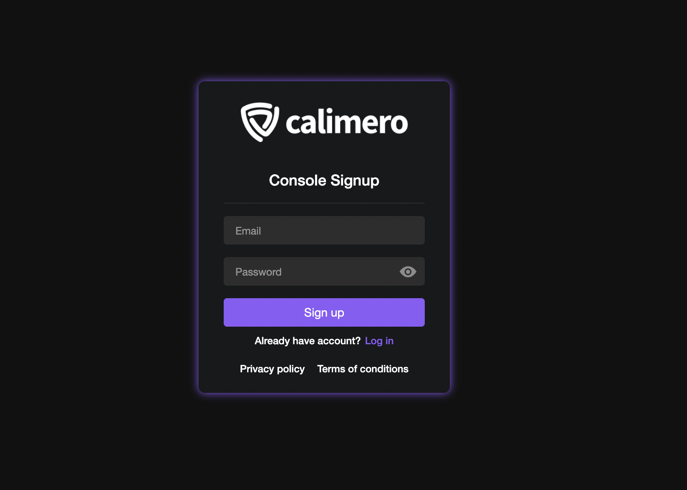

1. Navigate to [Calimero Console](https://app.calimero.network/dashboard) and sign up with your email and password.

After signing in you'll be directed to verify your email address. An email with will be sent to the email address provided.

2. You'll be prompted to also verify your billing info. This step helps to make sure that the card is valid and belongs to you.

3. Next, you will be directed to choose your shard type. Select the shard type for your needs. For more information, see our [pricing plans](https://www.calimero.network/plans)

:::note
Currently we only have support for Devlopers Shard, Professional Shard will be coming soon to the Calimero Network.
:::

4. Next, personalize your shard by adding a name and description for your shard.

5. Once the deployment process is complete, you will have access to your private shard on the Calimero Network.

## Need help?
Send a request to [support@calimero.network](mailto:support@calimero.network) or [https://www.calimero.network/trial](https://www.calimero.network/trial).
