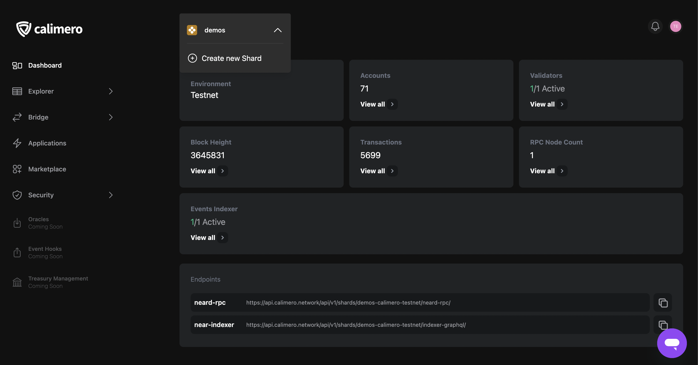
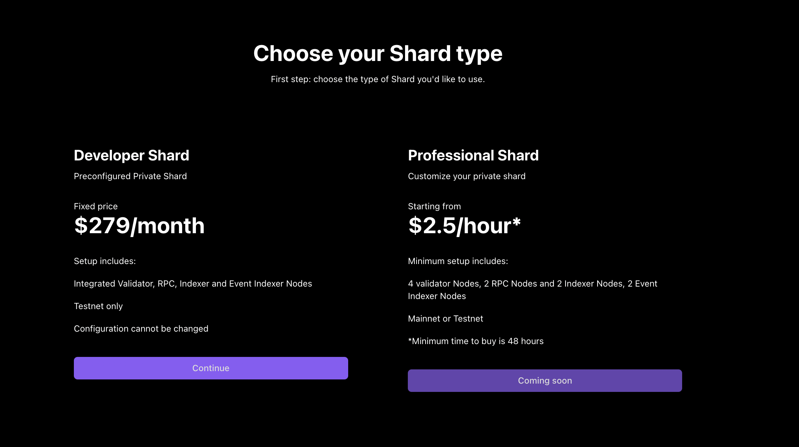
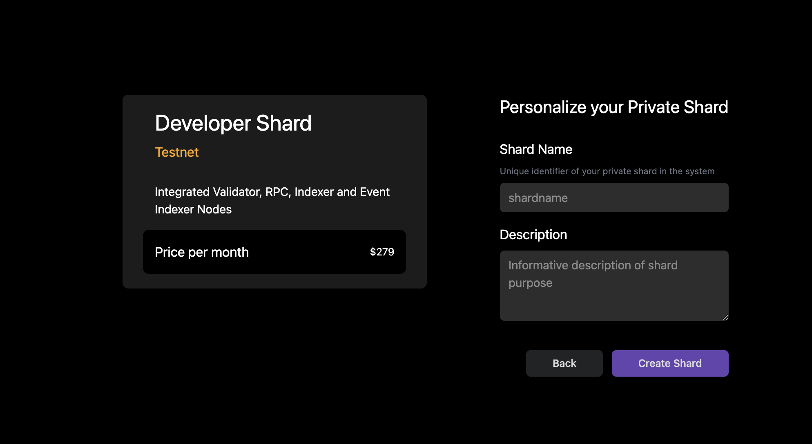

import Logo from '../../static/img/login_form.png';

In this guide, we will show you how to set up your own private shard on the Calimero Network. Follow these steps to get started:

1. Go to the [Calimero dashboard](https://app.calimero.network.) and sign in to create an account.  Once you have created an account, you will be redirected to the login form.

:::info
Currently we only have support for Permissioned Private Calimero Shard owned by a single entity ran on Calimero Infrastructure. We are working on support Permissioned Private Calimero Shard owned by a consortium and Public Calimero Shard owned by a community which will be coming soon to the Calimero Network.
:::

2. Click on the Shard dropdown on the top navigation bar. If this is your first time creating a shard, you will be prompted to select a shard type.

When creating your Shard for the first time you'll see this screen. Select Developer Shard as the shard type.

:::note
Currently we only have support for Devlopers Shard, Professional Shard will be coming soon to the Calimero Network.
:::

3. Add a name and description for your shard.
4. Click on Create Shard to start the deployment process.

Once the deployment process is complete, you will have access to your private shard on the Calimero Network.

## Need help?
Send a request to [support@calimero.network](support@calimero.network), or via https://www.calimero.network/trial.
