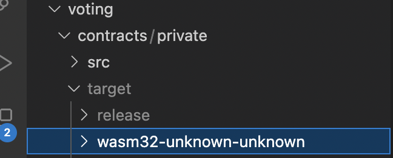
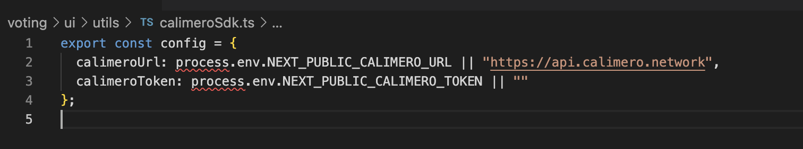
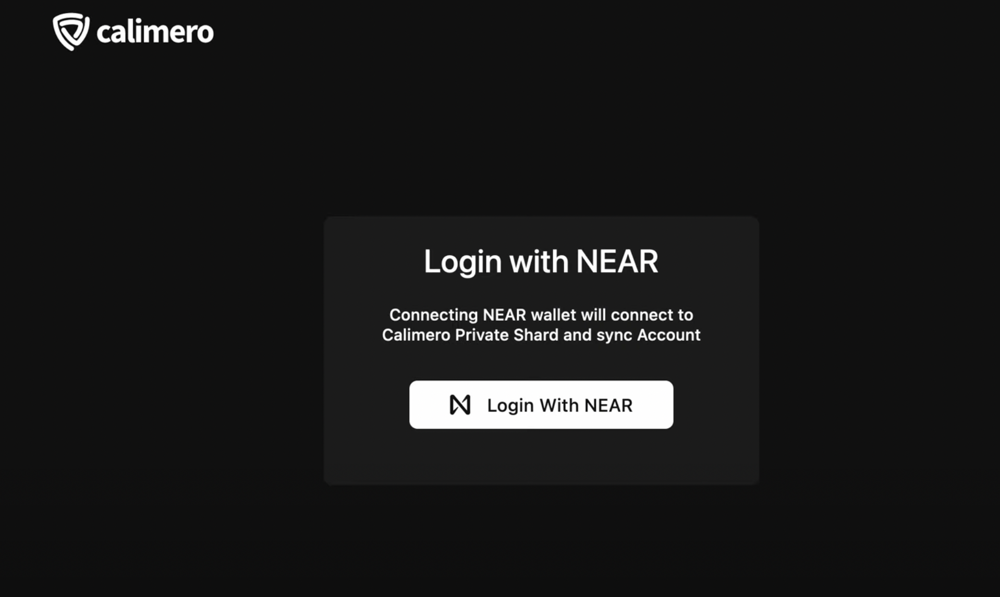
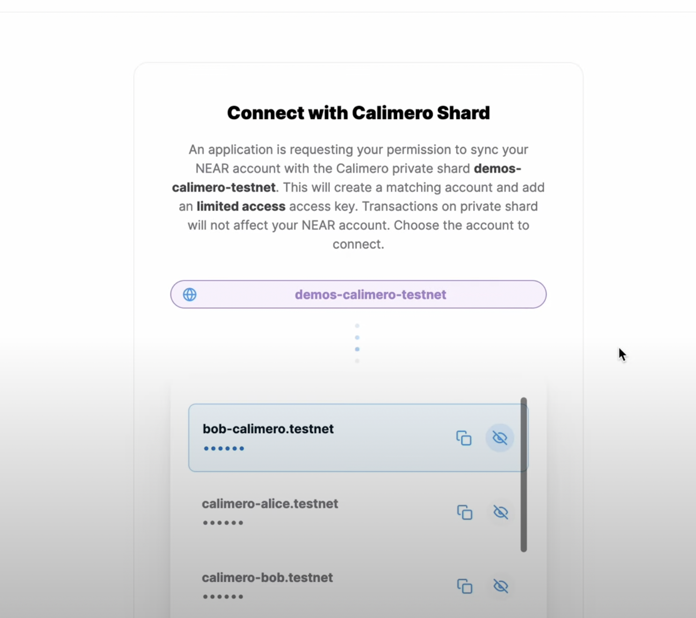
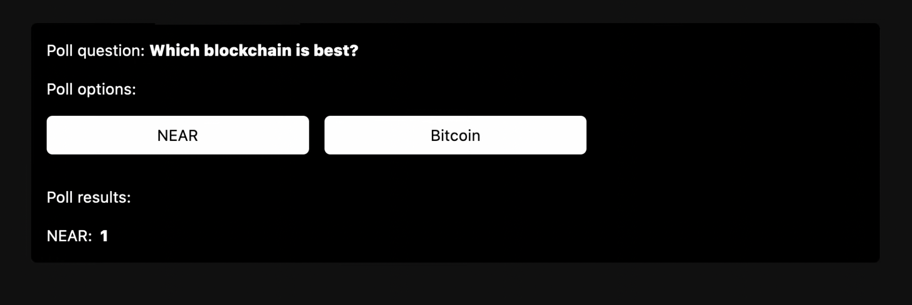

This tutorial will guide you through the process of deploying a voting smart contract Dapp on the Calimero Network.

## Prerequisite

Before you begin, ensure that you have the following prerequisites in place:

- Set up your [Calimero private shard](https://docs.calimero.network/getting_started/set_shard)
- A code editor like [VSCode](https://code.visualstudio.com/download)
- Install the [NEAR CLI](https://docs.near.org/tools/near-cli#setup) tool
- Install [Node.js and npm](https://docs.npmjs.com/downloading-and-installing-node-js-and-npm) on your machine.
- Install the [Rust and WASM](https://docs.near.org/develop/contracts/introduction#rust-and-wasm) toolchain

## Step 1: Build the Smart Contract

- Clone the [Calimero examples repository](https://github.com/calimero-is-near/calimero-examples) by running the following command in your terminal:

```bash
git clone https://github.com/calimero-is-near/calimero-examples
```

- Navigate to the `private` directory inside the `voting` folder.

```bash
cd calimero-examples/voting/contracts/private
```

- Compile the Rust smart contract to WASM by running the following command:

```bash
./build.sh
```

Once the compilation is complete, the compiled .wasm file of the contract will be located at:
`target/wasm32-unknown-unknown/release/poll.wasm`



## Step 2: Generate an Auth Token

Before deploying the Voting smart Dapp, you need to generate a Calimero auth token. This token will authenticate and authorize external applications to communicate with your shard. 

Follow the steps provided [here](/docs/getting_started/generate_token.md) to generate an auth token for your Calimero shard.

## Step 3: Set up the NEAR CLI

To interact with your Calimero shard using NEAR CLI, set the token value using the command `near set-api-key`. 

Follow the steps provided [here](/interact/cli#set-up-the-near-cli-to-access-the-shard-via-cli) to set up the NEAR CLI.

## Step 4: Create a Keypair 

Generate a new keypair for the shard account by running the following command:

```bash
 near generate-key SHARD_ID.calimero.testnet --networkId SHARD_ID-calimero-testnet
```

**Note**: Replace **SHARD_ID** with your shard name

Navigate to the `~/.near-credentials/` folder to locate the generated keypair file which is in a `.json` format:

```bash
cd ~/.near-credentials/network-id/account-id.json
```

Take note of the `account_id`, `private_key`, and `public_key` values from the .json file.

## Step 5: Create sub account

Create a sub account that will be used to deploy the previously built contract. This sub account should be created from the [Custodial account](/getting_started/custodial#create-custodial-account) in the Calimero Console, and the public key gotten from the generated keypair should be added to the subaccount.

Follow the steps [here](https://docs.calimero.network/getting_started/custodial#custodial-account) to set up the sub account and add public key.

## Step 6: Deploy your NEAR contract

Now, it's time to deploy your contract to the private shard. In your cloned repository's directory, open the `deploy_calimero.sh` file. Run the code found in the file

```bash
near deploy \
  --accountId "sub_account" \
  --initFunction new --initArgs '{"question": "Which blockchain is best?", "options": ["NEAR","Bitcoin"]}' \
  --wasmFile target/wasm32-unknown-unknown/release/poll.wasm \
  --nodeUrl "calimero-rpc-node-url" \
  --networkId "$1-shardID"
```

Modify the following parameters in the command:
- Replace _sub_account_  with the name of your sub account.
- Replace _calimero-rpc-node-url_ with the NEAR RPC endpoint obtained from the Calimero [Console](https://app.calimero.network/dashboard) dashboard.
- Replace _shardID_ with the name of your shard.

You can check the deployed contract on the [Explorer > Transactions](https://app.calimero.network/dashboard/explorer/transactions) page.


## Step 7: Update the config file and start the Dapp frontend:

To set up the frontend of your Dapp, follow these steps:

- Locate the `calimeroSdk.ts` file in the frontend code.

- Configure your connection settings in the `calimeroSdk.ts` file.




:::info
It is recommended to use environment variables (.env) to store these settings.
:::

The required configuration properties are:
 
- **NEXT_PUBLIC_CALIMERO_URL**: This is the RPC endpoint used for syncing accounts and querying shard data. You can find it on your Calimero Console dashboard under the endpoints table
- **NEXT_PUBLIC_CALIMERO_TOKEN**: This is the auth token you generated earlier from the console.

Run the following command to start your localhost server:

```bash
$ yarn && yarn dev
```

- Access your Dapp frontend through http://localhost:3000 and click **Login with NEAR**.



- Connect your shard by clicking on **Connect**, and select the desired account to participate in the poll.



- Click on any of the options and observe the immediate display of the results.


You can click on any of the options and also switch accounts to to click on the poll. Your result would be displayed immediately.



Congratulations! You have successfully deployed a voting application that can access shard contracts on the Calimero Network.
