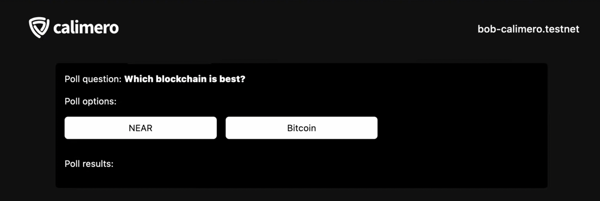

In this tutorial, we'll be deploying a voting smart contract Dapp on the Calimero Network.

## Prerequisite

To get started, ensure that you have the following:

- Set up your [Calimero private shard](https://docs.calimero.network/getting_started/set_shard)
- A code editor like [VSCode](https://code.visualstudio.com/download)
- The [Calimero examples repository](https://github.com/calimero-is-near/calimero-examples) cloned onto your local machine
- The [NEAR CLI](https://docs.near.org/tools/near-cli#setup) tool installed
- Node and npm installed in your machine
- The [Rust and WASM](https://docs.near.org/develop/contracts/introduction#rust-and-wasm) toolchain installed

## Build the smart contract

- Clone the [Calimero examples repository](https://github.com/calimero-is-near/calimero-examples)

```bash
git clone https://github.com/calimero-is-near/calimero-examples
```

- Go to the `private` in the voting directory 
- Compile the Rust smart contract to wasm using:

```bash
./build.sh
```

Compiled .wasm file of the contract located in :
`target/wasm32-unknown-unknown/release/poll.wasm`


## Generating an auth token

Before deploying the Voting smart dApp on our private shard, you must first generate a Calimero auth token. This token will authenticate and authorize external applications to communicate with our shard.Follow the steps here to generate an  [auth token](/docs/getting_started/generate_token.md). 


## Setting up the near CLI

To interact with Calimero shard using `near-cli`, you need to set the token value using **near set-api-key** command. Follow the steps here to set up the [near cli](/interact/cli#set-up-the-near-cli-to-access-the-shard-via-cli)

## Create a Keypair 

To create a new keypair for the shard main account, run the following

```bash
 near generate-key SHARD_ID.calimero.testnet --networkId SHARD_ID-calimero-testnet
```

Replace **SHARD_ID** with your shard name

This command will create a keypair in the `~/.near-credentials/` folder.

- Go to the `~/.near-credentials/` folder to view the  keypair file which is usually in a `.json` format.

```bash
cd ~/.near-credentials/network-id/account-id.json
```

From the `.json` file, you'll see the account_id, private_key and public_key

## Create sub account

You'll need create sub account which will be used to deploy the account that we have previously built. From the custodial account in the console you have the option to create a sub account. The keypair generated is added to the subaccount. this key is your Your public key can be gotten from the  `.json` file. 
Follow the steps here to set up the [sub account and add public key](/getting_started/custodial#create-custodial-account)

## Deploy your NEAR contract

The next step is to deploy this contract in the private shard. In your cloned repository, navigate to `deploy_calimero.sh`. Run the following code

```bash
near deploy \
  --accountId "" \
  --initFunction new --initArgs '{"question": "Which blockchain is best?", "options": ["NEAR","Bitcoin"]}' \
  --wasmFile target/wasm32-unknown-unknown/release/poll.wasm \
  --nodeUrl "calimero-rpc-node-url" \
  --networkId "$1-calimero-testnet"
```

- Replace the _accountID_ to your sub account name. In our example this will be  `yt-voting-example-1.demos.calimero.testnet`
- Replace _networkID_ to your shard name. In our example this will be `demos-calimero-testnet`
- For the `calimero-rpc-node-url`, go to the Calimero [Console dashboard](https://app.calimero.network/dashboard) and copy the the near RPC endpoint

 check this on the [Explorer > Transactions](https://app.calimero.network/dashboard/explorer/transactions) to see your deployed contract.


## Updating config file and starting up DAPP frontend

To set up the frontend, you'll need to:

- Configure your connection settings in the `calimeroSdk.ts` file.


:::info
We recommend using environment variables **.env** to save these settings. Here's a breakdown of what each configuration property does:
:::

- **NEXT_PUBLIC_CALIMERO_URL**: this is an RPC endpoint used for syncing account and querying shard data and can be found on your Calimero Console dashboard page under endpoints table.
- **NEXT_PUBLIC_CALIMERO_TOKEN**: auth token created (use the token previously created from the console).


- Run the following command to start your localhost

```bash
$ yarn && yarn dev
```

- From your http://localhost:3000  click **Login with NEAR**


- Connect your Shard


- Click on **Connect**. You'll be redirected to a screen with the poll options



You can click on any of the options and also switch accounts to to click on the poll. Your result would be displayed immediately.


That's it, you now have an application that can access shard contracts.
