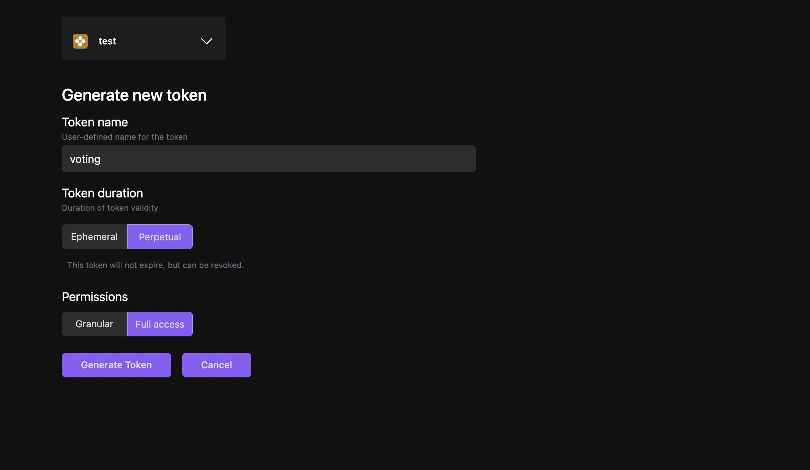

In this video, we'll be deploying a voting smart contract Dapp on the Calimero Network.

## Prerequisite

To get started, ensure that you have the following:

- Set up your [Calimero private shard](https://docs.calimero.network/getting_started/set_shard)
- A code editor like [VSCode](https://code.visualstudio.com/download)
- The [Calimero examples repository](https://github.com/calimero-is-near/calimero-examples) cloned onto your local machine
- The [NEAR CLI](https://docs.near.org/tools/near-cli#setup) tool installed
- Node and npm installed in your machine
- The [Rust and WASM](https://docs.near.org/develop/contracts/introduction#rust-and-wasm) toolchain installed

## Build smart contract

- Clone the [Calimero examples repository](https://github.com/calimero-is-near/calimero-examples)

```bash
git clone https://github.com/calimero-is-near/calimero-examples
```

- cd to the voting directory.

```bash
cd calimero-examples/voting
```

- Navigate to `contracts/private`
- Compile the Rust and WASM smart contract located using:

```bash
./build.sh
```

Compiled .wasm file of the contract located in :
`target/wasm32-unknown-unknown/release/poll.wasm`


## Generating an auth token

Before deploying the Voting smart dApp on our private shard, you must first generate a Calimero [auth token](/docs/getting_started/generate_token.md). This token will authenticate and authorize external applications to communicate with our shard.
To create an auth token, follow these steps:

- Log in to your Calimero Network account.
- Click on the **Security** dropdown in the left navigation menu.
- Select **Tokens**.
- Click on **Create new token**.
- Choose a name for your auth token.
- Select a duration for the token. For this demo, we will use a Perpetual token.
- Configure the token's permissions by selecting the appropriate checkboxes. In this case, we will select **Full access**.



:::tip
Make sure to store your token in a safe place, as it will be required to communicate with the private shard and cannot be obtained afterwards. For more information, see [Generate token](/docs/getting_started/generate_token.md).
:::

## Setting up the near CLI

To interact with Calimero shard using `near-cli`, you need to set the token value using **near set-api-key** command. 

- Set API key

```bash
 near set-api-key https://rpc.testnet.near.org <AUTH_TOKEN>   
```

Replace **<AUTH_TOKEN>** with your token value

:::note
The https://rpc.testnet.near.org value is currently ignored by the CLI. However, this issue is fixed and will be released in the next version of the CLI.
:::

- Create a new keypair for the shard main account (if your shard name is 'demos-calimero-testnet', your main account is 'demos.calimero.testnet').

```bash
 near generate-key SHARD_ID.calimero.testnet --networkId SHARD_ID-calimero-testnet
```

Replace **<SHARD_ID>** with your shard name

For our example this will be:

```bash
near generate-key demos.calimero.testnet --networkId demos-calimero-testnet
```

This command will create a keypair in the `~/.near-credentials/` folder.

- Go to the `~/.near-credentials/` folder to view the  keypair file which is usually in a `.json` format.

```bash
cd ~/.near-credentials/network-id/account-id.json
```

For our example, this will be:

```bash
cd ~/.near-credentials/network-id/demos-calimero-testnet
```

From the `.json` file, you'll see the account _id, private-key and public-key

## Link public key to console

From the `.json` file, you'll see the account _id, private-key and public-key. You'll need to copy the public key from the .json and link it to your account in the console.

- Open Calimero [Console](https://app.calimero.network/dashboard)
- Click on **Security**
- Click on **Custodial Accounts**
- Search for your custodian account ID in the list and click on the  `⋮` three dots menu.
- Click on Add public key


## Create sub account

Next, we will create sub account which will be used to deploy the account that we have previously built. Run the following command:

 ```bash
near create-account <SUB_ACCOUNT_ID>.SHARD_ID.calimero.testnet --masterAccount SHARD_ID.calimero.testnet --networkId SHARD_ID-calimero-testnet--nodeUrl https://api.calimero.network/api/v1/shards/SHARD_ID.calimero.testnet/neard-rpc/  
 ```

For our example, this will be

 ```bash
near create-account yt-voting-example-1.demos.calimero.testnet--masterAccount demos.calimero.testnet --networkId demos-calimero-testnet--nodeUrl https://api.calimero.network/api/v1/shards/demos.calimero.testnet/neard-rpc/  
 ```

- Replace **<SUB_ACCOUNT_ID>** with your sub account name which can be anything for e.g yt-voting-example
- Replace **<SHARD_ID>** with your shard name

After, the command has ben ran, you can check in the **Custodial Accounts** section in your console to view the sub account you created.


## Deploy your NEAR contract

The next step, is to deploy this contract in the private shard. In your cloned repository, navigate to `deploy.calimero.sh`. We will be using the second command which is `near deploy`

```bash
near deploy \
  --accountId "" \
  --initFunction new --initArgs '{"question": "Which blockchain is best?", "options": ["NEAR","Bitcoin"]}' \
  --wasmFile target/wasm32-unknown-unknown/release/poll.wasm \
  --nodeUrl "calimero-rpc-node-url" \
  --networkId "$1-calimero-testnet"
```

- Replace the _accountID_ to your sub account name. In our example this will be  `yt-voting-example-1.demos.calimero.testnet`
- Replace _networkID_ to your shard name. In our example this will be `demos-calimero-testnet`
- For the `calimero-rpc-node-url`, go to the Calimero [Console dashboard](https://app.calimero.network/dashboard) and copy the the near RPC endpoint

For our example, this will be

```bash
near deploy \
  --accountId "yt-voting-example-1.demos.calimero.testne" \
  --initFunction new --initArgs '{"question": "Which blockchain is best?", "options": ["NEAR","Bitcoin"]}' \
  --wasmFile target/wasm32-unknown-unknown/release/poll.wasm \
  --nodeUrl "https://api.calimero.network/api/v1/shards/demos-calimero-testnet/neard-rpc/  " \
  --networkId "demos-calimero-testnet"
```

If the contract was successfully deployed you can check this on the [Explorer > Transactions](https://app.calimero.network/dashboard/explorer/transactions) on your the console.


## Updating config file and starting up DAPP frontend

To set up the frontend, you'll need to:

- Configure your connection settings in the `calimeroSdk.ts` file.


:::info
We recommend using environment variables **.env** to save these settings. Here's a breakdown of what each configuration property does:
:::

- **NEXT_PUBLIC_CALIMERO_URL**: this is an RPC endpoint used for syncing account and querying shard data and can be found on your Calimero Console dashboard page under endpoints table.
- **NEXT_PUBLIC_CALIMERO_TOKEN**: auth token created (use the token previously created from the console).


- Run the following command to start your http://localhost:3000 

```bash
$ yarn && yarn dev
```

- From your http://localhost:3000  click **Login with NEAR**


- Connect your Shard


- Click on **Connect**. You'll be redirected to a screen with the poll options


You can click on any of the options and also switch accounts to to click on the poll. Your result would be displayed immediately.


That's it, you now have an application that can access shard contracts.
