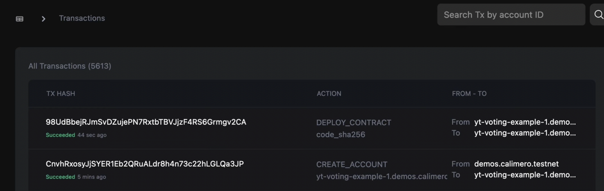

In this video, we'll be deploying a voting smart contract Dapp on the Calimero Network.

## Prerequisite

To get started, ensure that you have the following:

- Set up your [Calimero account](/docs/getting_started/signup.md)
- A code editor like [VSCode](https://code.visualstudio.com/download)
- The [Calimero examples repository](https://github.com/calimero-is-near/calimero-examples) cloned onto your local machine
- The [NEAR CLI](https://docs.near.org/tools/near-cli#setup) tool installed
- Node and npm installed in your machine
- The [Rust and WASM](https://docs.near.org/develop/contracts/introduction#rust-and-wasm) toolchain installed

## Build smart contract

- Clone the [Calimero examples repository](https://github.com/calimero-is-near/calimero-examples) and
- Navigate to the voting directory.
- Navigate to `contracts/private`
- Compile the Rust and WASM smart contract located using:

```bash
./build.sh
```

Compiled .wasm file of the contract located in :
`target/wasm32-unknown-unknown/release/poll.wasm`


## Generating an auth token

Before deploying the Voting smart dApp on our private shard, we must first generate a Calimero [auth token](/docs/getting_started/generate_token.md). This token will authenticate and authorize external applications to communicate with our shard.
To create an auth token, follow these steps:

- Log in to your Calimero Network account.
- Click on the Security dropdown in the left navigation menu.
- Select Tokens.
- Click on Create new token.
- Choose a name for your auth token.
- Select a duration for the token. For this demo, we will use a Perpetual token.
- Configure the token's permissions by selecting the appropriate checkboxes. In this case, we will select **Full access**.


Make sure to store your token in a safe place, as it will be required to communicate with the private shard and cannot be obtained afterwards. For more information, see [Generate token](/docs/getting_started/generate_token.md).

## Setting up the near CLI

To deploy a contract on a Calimero shard using `near-cli`, you need to set the token value that gives permission to deploy contracts and make function calls using **near set-api-key** command. But, as of now, the "--nodeUrl" option is ignored, so you have to set the default node to <https://rpc.testnet.near.org>. To set up your near CLI run the following commands, in your terminal:

1. Set API key

```
 near set-api-key https://rpc.testnet.near.org <AUTH_TOKEN>   
```

- **<AUTH_TOKEN>**: is your copied token ID. For more information, see [Generate token](/docs/getting_started/generate_token.md).

2. Create a new keypair for the shard main account (if your shard name is 'demos-calimero-testnet', your main account is 'demos.calimero.testnet').

```
 near generate-key <MAIN_ACCOUNT_ID> --networkId <SHARD_ID>   
```
In our example this will be

```
 near generate-key demos.calimero.testnet --networkId demos-calimero-testnet
```

- **<MAIN_ACCOUNT_ID>**: is your account ID.  For more information, see [Access account ID](/docs/getting_started/access_account.md)
- **<SHARD_ID>**: is your shard name. For more information, see [set up your shard](/docs/getting_started/running_a_shard.md)

3. The previous command will generate a new keypair and stored it in  `~/.near-credentials/` folder. Navigate to the `~/.near-credentials/` folder to access your keypair.

```
cd ~/.near-credentials
```

Then navigate to your stored keypair file which is usually in a `.json` format.

4. Open your `.json` file and copy the Public key.
5. Open Calimero [Console](https://app.calimero.network/dashboard)
6. Click on **Security**
7. Click on **Accounts**
8. Search for your **Main Account**  in the list and click on the  `⋮` three dots menu.
9. Click on Add public key


## Create sub account

In NEAR it’s possible to add code to the accounts for that create contract. You can arbitrarily name the sub-account id. Main accounts can create sub-accounts of themselves, helping to better organize related-accounts.

 ```bash
  near create-account <SUB_ACCOUNT_ID>.<MAIN_ACCOUNT_ID> --masterAccount <MAIN_ACCOUNT_ID> --networkId <SHARD_ID> --nodeUrl https://api.calimero.network/api/v1/shards/<SHARD_ID>/neard-rpc/  
 ```

 In our example, this will be

 ```bash
  near create-account yt-voting-example.demos.calimero.testnet--masterAccount demos.calimero.testnet --networkId demos-calimero-testnet--nodeUrl https://api.calimero.network/api/v1/shards/test.calimero.testnet/neard-rpc/  
 ```

- **<SUB_ACCOUNT_ID>**: Sub account can be anything for e.g voting-app-example
- **<MAIN_ACCOUNT_ID>**: is your account ID.  For more information, see [Access account ID](/docs/getting_started/access_account.md)
- **<SHARD_ID>**: is your shard name. For more information, see [set up your shard](/docs/getting_started/running_a_shard.md)

After, you run the command you can check in the **Accounts** section in your console to view the sub account you created.

## Deploy your NEAR contract

Back to your cloned repo, in `deployl.calimero.sh`.  You'll see the NEAR deploy command. Before running the command change the values to match yours

```
near deploy \
  --accountId "voting.$destination_master_account" \
  --initFunction new --initArgs '{"question": "Which blockchain is best?", "options": ["NEAR","Bitcoin"]}' \
  --wasmFile target/wasm32-unknown-unknown/release/poll.wasm \
  --nodeUrl "calimero-rpc-node-url" \
  --networkId "$1-calimero-testnet"
```

- Change the accountID to your sub account name. In our example this will be `--accountId "yt-voting-example.demos.calimero.testnet"`
- Change networkID to your shard name. In our example this will be `--networkId "demos-calimero-testnet"`
- For the `calimero-rpc-node-url`, go to the Calimero [Console dashboard](https://app.calimero.network/dashboard) and copy the the near rpc endpoint


To view your NEAR contract that was deployed go to **Indexer > Transactions** on your  Calimero [Console](https://app.calimero.network/dashboard)




## Updating config file and starting up DAPP frontend
To set up the frontend, you'll need to:

1. Configure your connection settings in the "calimeroSdk.ts" file.


We recommend using environment variables `.env`  to save these settings. Here's a breakdown of what each configuration property does:

- **NEXT_PUBLIC_CALIMERO_URL**: this is an RPC endpoint used for syncing account and querying shard data and can be found on your Calimero Console dashboard page under endpoints table.
- **NEXT_PUBLIC_CALIMERO_TOKEN**: auth token for the RPC node (use the token previously created from the console).


2. Run the following command to start your http://localhost:3000 

```
$ yarn && yarn dev
```


3. From your http://localhost:3000  click **Login wit NEAR**. You'll be redirected to wear you can connect your Shard


4. Click on **Connect**. You'll be redirected to a screen with the poll options


You can click on any of the options and also switch accounts to to click on the poll. Your result would be displayed immediately 


That's it, you now have an application that can access shard contracts.

## Need help?

Send a request to [support@calimero.network](mailto:support@calimero.network) or [https://www.calimero.network/trial](https://www.calimero.network/trial).
